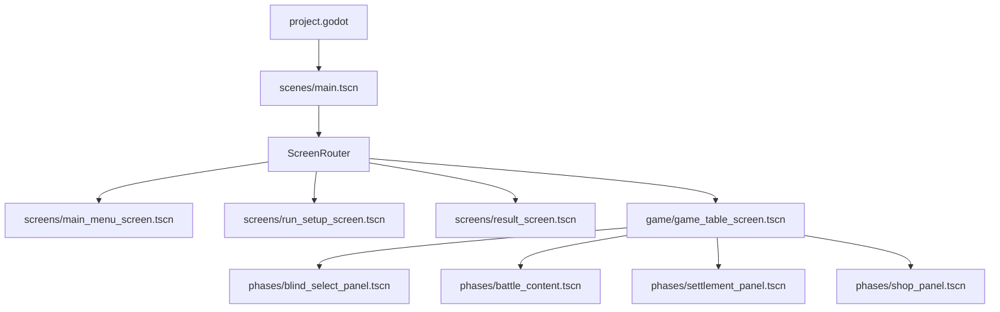

# 项目资源依赖审计报告

> 生成时间：2026-07-15T23:09:51+08:00
> 扫描根目录：`E:\game\PokerRogueCN`
> 范围：排除 `.git/`、Godot 本地缓存 `.godot/` 与 Python `__pycache__/`；包含被 Git 忽略的 `artifacts/`、`output/`。

## 执行摘要

- 扫描文件：**1739**，总大小 **535.2 MiB**。
- 正式运行静态可达：**266** 个文件；动态可达：**222** 个文件。
- 测试专用：**240** 个文件。
- 高置信孤立候选：**0** 个主文件；保守可清理估算（含配套 sidecar）**0 B**。
- 修正历史清单/测试后，Batch C/D 条件候选预计 **0 B**；这不是本轮删除许可。
- 完全重复：**15** 组、**23** 个冗余副本；近似重复候选：**1608** 对。
- 无效 JSON：**0**；不存在的 `res://` 引用：**0**。

## 当前真实运行入口

- `run/main_scene`：`res://scenes/main.tscn`。
- Autoload：`res://autoload/data_registry.gd`, `res://autoload/game.gd`, `res://autoload/audio_manager.gd`, `res://addons/godot_ai/runtime/game_helper.gd`。
- 全局 Theme：`res://assets/ui/theme/game_theme.tres`。
- 图标：`res://icon.svg`。
- 编辑器插件（DEV_ONLY）：`res://addons/godot_ai/plugin.cfg`。
- `ScreenRouter` 的 HOME / DECK_SELECT / GAME_OVER、VICTORY 分别进入 `scenes/screens/main_menu_screen.tscn`、`run_setup_screen.tscn`、`result_screen.tscn`；STAGE_SELECT / ROUND / SETTLEMENT / SHOP 共用 `scenes/game/game_table_screen.tscn`。
- 统一游戏桌内的阶段内容由 `blind_select_panel.tscn`、`battle_content.tscn`、`settlement_panel.tscn`、`shop_panel.tscn` 承载，属于同一场景常驻子树，而不是四个顶层页面。

## 正式场景依赖图



### 可达正式场景

- `res://scenes/cards/joker_card_view.tscn`
- `res://scenes/cards/playing_card_view.tscn`
- `res://scenes/game/game_hud_panel.tscn`
- `res://scenes/game/game_table_screen.tscn`
- `res://scenes/game/phases/battle_content.tscn`
- `res://scenes/game/phases/blind_select_panel.tscn`
- `res://scenes/game/phases/settlement_panel.tscn`
- `res://scenes/game/phases/shop_panel.tscn`
- `res://scenes/game/stage_card_view.tscn`
- `res://scenes/game/table/consumable_tray.tscn`
- `res://scenes/game/table/deck_area.tscn`
- `res://scenes/game/table/joker_shelf.tscn`
- `res://scenes/main.tscn`
- `res://scenes/screens/main_menu_screen.tscn`
- `res://scenes/screens/result_screen.tscn`
- `res://scenes/screens/run_setup_screen.tscn`
- `res://scenes/shop/shop_offer_card.tscn`
- `res://scenes/ui/card_detail_popup.tscn`
- `res://scenes/ui/deck_select_screen.tscn`
- `res://scenes/ui/floating_score_label.tscn`
- `res://scenes/ui/main_menu_screen.tscn`
- `res://scenes/ui/result_screen.tscn`
- `res://scenes/ui/shared/bottom_sheet_host.tscn`
- `res://scenes/ui/shared/consumable_slot_view.tscn`

## 动态资源依赖

- `scripts/ui/art_resolver.gd` 静态读取 `assets/cards/card_art_manifest.json`；清单内的 `items`、分类 fallback、subtype fallback 与 unknown fallback 均按 `REACHABLE_RUNTIME_DYNAMIC` 传播。
- `scripts/cards/playing_card_view.gd` 以 rank/suit 拼接 `assets/cards/poker/faces/%s_%s.png`；审计器把目录中 52 张 `.png` 及其 `.import` 配对纳入动态运行资源。
- `assets/ui/runtime/generated/jokers/**` 是 ArtResolver 的受保护动态目录族；即使新专属图片暂未写回清单，也标记为动态保留。
- `autoload/data_registry.gd` 读取 `data/**.json` 作为正式数据入口；AudioManager 的 BGM/SFX `preload` 均属于静态运行依赖。
- `ui_asset_catalog.json` 是切片来源元数据；按钮 manifest 与 normalization 报告已位于 `tools/reports/buttons/`，不会升级为正式运行依赖。

## 文件分类统计（唯一主分类）

| 分类 | 文件数 | 大小 |
|---|---:|---:|
| REACHABLE_RUNTIME_STATIC | 390 | 123.5 MiB |
| REACHABLE_RUNTIME_DYNAMIC | 435 | 11.6 MiB |
| TEST_ONLY | 240 | 32.0 MiB |
| TOOL_ONLY | 11 | 141.8 KiB |
| DEV_ONLY | 225 | 1.1 MiB |
| SOURCE_ONLY | 50 | 28.8 MiB |
| DOC_ONLY | 369 | 331.4 MiB |
| ORPHAN_CANDIDATE | 18 | 6.8 MiB |
| KEEP_UNCERTAIN | 1 | 0 B |

## 状态标签统计（允许重叠）

| 标签 | 文件数 | 大小 |
|---|---:|---:|
| DEV_ONLY | 225 | 1.1 MiB |
| DOC_ONLY | 374 | 331.4 MiB |
| DUPLICATE_CONTENT | 38 | 82.3 MiB |
| KEEP_UNCERTAIN | 1 | 0 B |
| NEAR_DUPLICATE | 286 | 216.1 MiB |
| ORPHAN_CANDIDATE | 18 | 6.8 MiB |
| REACHABLE_RUNTIME_DYNAMIC | 443 | 12.1 MiB |
| REACHABLE_RUNTIME_STATIC | 390 | 123.5 MiB |
| SOURCE_ONLY | 62 | 49.0 MiB |
| TEST_ONLY | 240 | 32.0 MiB |
| TOOL_ONLY | 11 | 141.8 KiB |

## 目录用途与体积

- `scenes/`、`scripts/`、`autoload/`、`data/`：正式代码/数据与测试可达组件混合，必须按图可达性处理。
- `assets/ui/runtime/`：只保留 Godot 可加载的正式图像、切片输出和运行资源目录；工具报告已移出。
- `art_source/ui/extracted/` 与 reference 类目录：离线切片来源及可追溯素材，标为 SOURCE_ONLY，并由 `.gdignore` 排除 Godot 导入。
- `tests/`：可执行完整性、流程、分辨率与截图验证入口；其依赖与正式运行依赖分开统计。
- `tools/`：生成器、切片器、按钮审计和本扫描器；生成源与工具报告属于 TOOL_ONLY/SOURCE_ONLY。
- `docs/`、`artifacts/`、`output/`：文档、验收截图和生成输出；docs 已由 `.gdignore` 排除，artifacts/output 保持忽略。
- `addons/`、`scenes/debug/`：编辑器插件与调试画廊，归 DEV_ONLY。

### 最大目录 Top 20

| 目录 | 文件数 | 大小 |
|---|---:|---:|
| `artifacts/` | 326 | 309.2 MiB |
| `artifacts/final_scene_review/` | 273 | 241.3 MiB |
| `assets/` | 914 | 173.0 MiB |
| `assets/ui/` | 737 | 161.9 MiB |
| `artifacts/final_scene_review/resolutions/` | 120 | 154.9 MiB |
| `assets/ui/fonts/` | 4 | 105.9 MiB |
| `art_source/` | 50 | 28.8 MiB |
| `assets/ui/runtime/` | 595 | 28.5 MiB |
| `artifacts/final_scene_review/game_table/` | 20 | 26.4 MiB |
| `art_source/ui/` | 46 | 26.1 MiB |
| `art_source/ui/extracted/` | 44 | 26.1 MiB |
| `artifacts/final_scene_review/components/` | 70 | 24.4 MiB |
| `docs/` | 35 | 22.2 MiB |
| `docs/visual_delayering_phase1/` | 13 | 21.6 MiB |
| `artifacts/ui_review/` | 16 | 21.1 MiB |
| `assets/ui/references/` | 12 | 20.2 MiB |
| `artifacts/button_review/` | 18 | 19.4 MiB |
| `artifacts/scene_refactor/` | 12 | 16.2 MiB |
| `artifacts/final_scene_review/run_setup/` | 10 | 11.8 MiB |
| `docs/visual_delayering_phase1/before/` | 5 | 11.6 MiB |

### 最大文件 Top 30

| 文件 | 分类 | 大小 |
|---|---|---:|
| `assets/ui/fonts/ChillHuoGothic_F_Bold.otf` | REACHABLE_RUNTIME_STATIC | 54.8 MiB |
| `assets/ui/fonts/ChillHuoGothic_F_ConBold.otf` | REACHABLE_RUNTIME_STATIC | 51.1 MiB |
| `artifacts/final_scene_review/resolutions/home_default_2560x1440.png` | DOC_ONLY | 4.7 MiB |
| `artifacts/final_scene_review/resolutions/result_game_over_2560x1440.png` | DOC_ONLY | 4.1 MiB |
| `artifacts/final_scene_review/resolutions/result_victory_2560x1440.png` | DOC_ONLY | 4.1 MiB |
| `artifacts/final_scene_review/resolutions/shop_default_2560x1440.png` | DOC_ONLY | 3.9 MiB |
| `artifacts/final_scene_review/resolutions/card_detail_long_2560x1440.png` | DOC_ONLY | 3.9 MiB |
| `artifacts/final_scene_review/resolutions/blind_select_default_2560x1440.png` | DOC_ONLY | 3.8 MiB |
| `artifacts/final_scene_review/resolutions/battle_default_2560x1440.png` | DOC_ONLY | 3.8 MiB |
| `artifacts/final_scene_review/resolutions/run_setup_default_2560x1440.png` | DOC_ONLY | 3.6 MiB |
| `artifacts/final_scene_review/resolutions/settlement_complete_2560x1440.png` | DOC_ONLY | 3.6 MiB |
| `assets/ui/references/battle_reference.png` | TEST_ONLY | 3.5 MiB |
| `assets/ui/references/home_reference.png` | TEST_ONLY | 3.4 MiB |
| `assets/ui/references/settlement_reference.png` | TEST_ONLY | 3.4 MiB |
| `assets/ui/references/stage_select_reference.png` | TEST_ONLY | 3.4 MiB |
| `assets/ui/references/shop_reference.png` | TEST_ONLY | 3.4 MiB |
| `artifacts/final_scene_review/resolutions/result_game_over_2520x1080.png` | DOC_ONLY | 3.3 MiB |
| `artifacts/final_scene_review/resolutions/blind_select_default_2520x1080.png` | DOC_ONLY | 3.3 MiB |
| `artifacts/final_scene_review/resolutions/result_victory_2520x1080.png` | DOC_ONLY | 3.2 MiB |
| `artifacts/final_scene_review/resolutions/shop_default_2520x1080.png` | DOC_ONLY | 3.2 MiB |
| `artifacts/final_scene_review/resolutions/shop_pack_open_2560x1440.png` | DOC_ONLY | 3.2 MiB |
| `assets/ui/references/deck_select_reference.png` | TEST_ONLY | 3.1 MiB |
| `artifacts/final_scene_review/resolutions/card_detail_long_2520x1080.png` | DOC_ONLY | 3.1 MiB |
| `artifacts/final_scene_review/resolutions/home_default_2520x1080.png` | DOC_ONLY | 3.1 MiB |
| `artifacts/final_scene_review/resolutions/settlement_complete_2520x1080.png` | DOC_ONLY | 3.0 MiB |
| `artifacts/final_scene_review/resolutions/battle_default_2520x1080.png` | DOC_ONLY | 3.0 MiB |
| `artifacts/ui_review/home.png` | DOC_ONLY | 3.0 MiB |
| `artifacts/final_scene_review/resolutions/home_default_1920x1200.png` | DOC_ONLY | 3.0 MiB |
| `artifacts/final_scene_review/home/home_start_hover_1920x1080.png` | DOC_ONLY | 3.0 MiB |
| `artifacts/final_scene_review/components/ui__main_menu_screen_1920x1080.png` | DOC_ONLY | 3.0 MiB |

## 第二轮整理后复核

- 正式可达场景：**24**；生产测试使用显式清单，`scenes/debug/` 不参与。
- README 已描述统一游戏桌、阶段面板和常驻桌面组件，不再把旧全屏阶段场景作为入口。
- 按钮 manifest 与 normalization 报告位于 `tools/reports/buttons/`，不再混入 runtime 资产。
- 两份 art pipeline manifest 中的本机绝对路径：**0**。
- `art_source/`：**28.8 MiB**，作为离线源图并由 `.gdignore` 排除导入。
- `docs/`：**22.2 MiB**，保留文档与验收证据并由根 `.gdignore` 排除导入。
- `artifacts/`：**309.2 MiB**，为被忽略的本地验收输出。
- `output/`：**939 B**，保持忽略；已验收候选图移入 `art_source/generated/`。
- `scenes/debug/button_style_gallery.tscn` 明确为 DEV_ONLY，并与生产清单分离。


## Theme / StyleBox 审计

- StyleBox 文件总数：**111**。
- 发现任意有效引用：**111**；未发现引用：**0**。
- 内容完全相同：**0** 组 / **0** 个文件。
- 仅 `modulate_color` 不同：**25** 组 / **103** 个文件。
- 同纹理派生按钮族：**26** 族 / **105** 个样式。
- 上述是收敛候选而非删除许可；必须先对照按钮状态、边距、焦点与禁用态回归测试。

## 完全重复文件

- **2.7 MiB × 4**：`artifacts/scene_refactor/game_table_battle.png`, `artifacts/scene_refactor/game_table_blind_select.png`, `artifacts/scene_refactor/game_table_settlement.png`, `artifacts/scene_refactor/game_table_shop.png`
- **2.7 MiB × 2**：`artifacts/final_scene_review/components/screens__result_screen_1920x1080.png`, `artifacts/final_scene_review/components/ui__result_screen_1920x1080.png`
- **2.7 MiB × 2**：`artifacts/final_scene_review/game_table/shop/shop_item_sold_1920x1080.png`, `docs/visual_delayering_phase1/before/shop_item_sold_1920x1080.png`
- **2.7 MiB × 2**：`artifacts/final_scene_review/resolutions/shop_default_1920x1080.png`, `docs/visual_delayering_phase1/before/shop_default_1920x1080.png`
- **2.7 MiB × 2**：`artifacts/final_scene_review/game_table/shop/shop_insufficient_funds_1920x1080.png`, `docs/visual_delayering_phase1/before/shop_insufficient_funds_1920x1080.png`
- **2.6 MiB × 4**：`artifacts/final_scene_review/game_table/battle/battle_discard_disabled_1920x1080.png`, `artifacts/final_scene_review/game_table/battle/battle_play_disabled_1920x1080.png`, `artifacts/final_scene_review/game_table/battle/battle_sort_rank_1920x1080.png`, `artifacts/final_scene_review/resolutions/battle_default_1920x1080.png`
- **2.4 MiB × 6**：`artifacts/final_scene_review/components/screens__run_setup_screen_1920x1080.png`, `artifacts/final_scene_review/components/ui__deck_select_screen_1920x1080.png`, `artifacts/final_scene_review/resolutions/run_setup_default_1920x1080.png`, `artifacts/final_scene_review/run_setup/run_setup_continue_disabled_1920x1080.png`, `artifacts/final_scene_review/run_setup/run_setup_prev_deck_hover_1920x1080.png`, `artifacts/final_scene_review/run_setup/run_setup_start_hover_1920x1080.png`
- **2.2 MiB × 2**：`artifacts/final_scene_review/resolutions/shop_pack_open_1920x1080.png`, `docs/visual_delayering_phase1/before/shop_pack_open_1920x1080.png`
- **1.9 MiB × 2**：`artifacts/visual_delayering_phase1/after/shop_product_hover_1920x1080.png`, `docs/visual_delayering_phase1/after/shop_product_hover_1920x1080.png`
- **1.8 MiB × 2**：`artifacts/visual_delayering_phase1/after/shop_default_1920x1080.png`, `docs/visual_delayering_phase1/after/shop_default_1920x1080.png`
- **1.8 MiB × 2**：`artifacts/visual_delayering_phase1/after/shop_item_sold_1920x1080.png`, `docs/visual_delayering_phase1/after/shop_item_sold_1920x1080.png`
- **1.8 MiB × 2**：`artifacts/visual_delayering_phase1/after/shop_insufficient_funds_1920x1080.png`, `docs/visual_delayering_phase1/after/shop_insufficient_funds_1920x1080.png`
- **1.7 MiB × 2**：`artifacts/visual_delayering_phase1/after/shop_pack_open_1920x1080.png`, `docs/visual_delayering_phase1/after/shop_pack_open_1920x1080.png`
- **1.3 MiB × 2**：`artifacts/final_scene_review/resolutions/shop_default_1280x720.png`, `docs/visual_delayering_phase1/before/shop_default_1280x720.png`
- **10.3 KiB × 2**：`artifacts/final_scene_review/components/ui__shared__blind_token_view_1920x1080.png`, `artifacts/final_scene_review/components/ui__shared__bottom_sheet_host_1920x1080.png`

## 近似重复图片候选

dHash 距离仅用于人工复核，不作为删除依据：
- 距离 0：`art_source/ui/extracted/battle/battle_background_frame.png` ↔ `assets/ui/runtime/frames/game_table_frame.png`
- 距离 0：`art_source/ui/extracted/cards/rank_symbols_dark.png` ↔ `art_source/ui/extracted/cards/rank_symbols_red.png`
- 距离 0：`artifacts/button_review/home_buttons.png` ↔ `artifacts/final_scene_review/components/screens__main_menu_screen_1920x1080.png`
- 距离 0：`artifacts/button_review/home_buttons.png` ↔ `artifacts/final_scene_review/components/ui__main_menu_screen_1920x1080.png`
- 距离 0：`artifacts/button_review/home_buttons.png` ↔ `artifacts/final_scene_review/home/home_language_hover_1920x1080.png`
- 距离 0：`artifacts/button_review/home_buttons.png` ↔ `artifacts/final_scene_review/home/home_options_hover_1920x1080.png`
- 距离 0：`artifacts/button_review/home_buttons.png` ↔ `artifacts/final_scene_review/home/home_start_hover_1920x1080.png`
- 距离 0：`artifacts/button_review/home_buttons.png` ↔ `artifacts/final_scene_review/resolutions/home_default_1920x1080.png`
- 距离 0：`artifacts/button_review/home_buttons.png` ↔ `artifacts/scene_refactor/home.png`
- 距离 0：`artifacts/button_review/result_buttons.png` ↔ `artifacts/final_scene_review/resolutions/result_victory_1920x1080.png`
- 距离 0：`artifacts/final_scene_review/components/cards__deck_pile_view_1920x1080.png` ↔ `artifacts/final_scene_review/components/shop__shop_offer_card_1920x1080.png`
- 距离 0：`artifacts/final_scene_review/components/cards__deck_pile_view_1920x1080.png` ↔ `artifacts/final_scene_review/components/ui__shared__currency_display_1920x1080.png`
- 距离 0：`artifacts/final_scene_review/components/cards__deck_pile_view_1920x1080.png` ↔ `artifacts/final_scene_review/components/ui__shared__textured_button_1920x1080.png`
- 距离 0：`artifacts/final_scene_review/components/game__game_table_screen_1920x1080.png` ↔ `artifacts/final_scene_review/resolutions/blind_select_default_1920x1080.png`
- 距离 0：`artifacts/final_scene_review/components/game__table__consumable_tray_1920x1080.png` ↔ `artifacts/final_scene_review/components/ui__shared__consumable_slot_view_1920x1080.png`
- 距离 0：`artifacts/final_scene_review/components/game__table__consumable_tray_1920x1080.png` ↔ `artifacts/final_scene_review/components/ui__shared__empty_card_slot_1920x1080.png`
- 距离 0：`artifacts/final_scene_review/components/game__table__consumable_tray_1920x1080.png` ↔ `artifacts/final_scene_review/components/ui__shared__price_plate_1920x1080.png`
- 距离 0：`artifacts/final_scene_review/components/game__table__deck_area_1920x1080.png` ↔ `artifacts/final_scene_review/components/ui__floating_score_label_1920x1080.png`
- 距离 0：`artifacts/final_scene_review/components/game__table__deck_area_1920x1080.png` ↔ `artifacts/final_scene_review/components/ui__shared__reward_row_1920x1080.png`
- 距离 0：`artifacts/final_scene_review/components/screens__main_menu_screen_1920x1080.png` ↔ `artifacts/final_scene_review/components/ui__main_menu_screen_1920x1080.png`
- 距离 0：`artifacts/final_scene_review/components/screens__main_menu_screen_1920x1080.png` ↔ `artifacts/final_scene_review/home/home_language_hover_1920x1080.png`
- 距离 0：`artifacts/final_scene_review/components/screens__main_menu_screen_1920x1080.png` ↔ `artifacts/final_scene_review/home/home_options_hover_1920x1080.png`
- 距离 0：`artifacts/final_scene_review/components/screens__main_menu_screen_1920x1080.png` ↔ `artifacts/final_scene_review/home/home_start_hover_1920x1080.png`
- 距离 0：`artifacts/final_scene_review/components/screens__main_menu_screen_1920x1080.png` ↔ `artifacts/final_scene_review/resolutions/home_default_1920x1080.png`
- 距离 0：`artifacts/final_scene_review/components/screens__main_menu_screen_1920x1080.png` ↔ `artifacts/scene_refactor/home.png`
- 距离 0：`artifacts/final_scene_review/components/screens__result_screen_1920x1080.png` ↔ `artifacts/final_scene_review/resolutions/result_game_over_1920x1080.png`
- 距离 0：`artifacts/final_scene_review/components/screens__run_setup_screen_1920x1080.png` ↔ `artifacts/final_scene_review/run_setup/run_setup_continue_enabled_1920x1080.png`
- 距离 0：`artifacts/final_scene_review/components/shop__shop_offer_card_1920x1080.png` ↔ `artifacts/final_scene_review/components/ui__shared__currency_display_1920x1080.png`
- 距离 0：`artifacts/final_scene_review/components/shop__shop_offer_card_1920x1080.png` ↔ `artifacts/final_scene_review/components/ui__shared__textured_button_1920x1080.png`
- 距离 0：`artifacts/final_scene_review/components/ui__deck_select_screen_1920x1080.png` ↔ `artifacts/final_scene_review/run_setup/run_setup_continue_enabled_1920x1080.png`
- 距离 0：`artifacts/final_scene_review/components/ui__floating_score_label_1920x1080.png` ↔ `artifacts/final_scene_review/components/ui__shared__reward_row_1920x1080.png`
- 距离 0：`artifacts/final_scene_review/components/ui__main_menu_screen_1920x1080.png` ↔ `artifacts/final_scene_review/home/home_language_hover_1920x1080.png`
- 距离 0：`artifacts/final_scene_review/components/ui__main_menu_screen_1920x1080.png` ↔ `artifacts/final_scene_review/home/home_options_hover_1920x1080.png`
- 距离 0：`artifacts/final_scene_review/components/ui__main_menu_screen_1920x1080.png` ↔ `artifacts/final_scene_review/home/home_start_hover_1920x1080.png`
- 距离 0：`artifacts/final_scene_review/components/ui__main_menu_screen_1920x1080.png` ↔ `artifacts/final_scene_review/resolutions/home_default_1920x1080.png`
- 距离 0：`artifacts/final_scene_review/components/ui__main_menu_screen_1920x1080.png` ↔ `artifacts/scene_refactor/home.png`
- 距离 0：`artifacts/final_scene_review/components/ui__result_screen_1920x1080.png` ↔ `artifacts/final_scene_review/resolutions/result_game_over_1920x1080.png`
- 距离 0：`artifacts/final_scene_review/components/ui__shared__consumable_slot_view_1920x1080.png` ↔ `artifacts/final_scene_review/components/ui__shared__empty_card_slot_1920x1080.png`
- 距离 0：`artifacts/final_scene_review/components/ui__shared__consumable_slot_view_1920x1080.png` ↔ `artifacts/final_scene_review/components/ui__shared__price_plate_1920x1080.png`
- 距离 0：`artifacts/final_scene_review/components/ui__shared__currency_display_1920x1080.png` ↔ `artifacts/final_scene_review/components/ui__shared__textured_button_1920x1080.png`
- 距离 0：`artifacts/final_scene_review/components/ui__shared__empty_card_slot_1920x1080.png` ↔ `artifacts/final_scene_review/components/ui__shared__price_plate_1920x1080.png`
- 距离 0：`artifacts/final_scene_review/game_table/battle/battle_discard_disabled_1920x1080.png` ↔ `artifacts/final_scene_review/game_table/battle/battle_one_selected_1920x1080.png`
- 距离 0：`artifacts/final_scene_review/game_table/battle/battle_one_selected_1920x1080.png` ↔ `artifacts/final_scene_review/game_table/battle/battle_play_disabled_1920x1080.png`
- 距离 0：`artifacts/final_scene_review/game_table/battle/battle_one_selected_1920x1080.png` ↔ `artifacts/final_scene_review/game_table/battle/battle_sort_rank_1920x1080.png`
- 距离 0：`artifacts/final_scene_review/game_table/battle/battle_one_selected_1920x1080.png` ↔ `artifacts/final_scene_review/resolutions/battle_default_1920x1080.png`
- 距离 0：`artifacts/final_scene_review/game_table/shop/shop_item_sold_1920x1080.png` ↔ `artifacts/final_scene_review/resolutions/shop_default_1920x1080.png`
- 距离 0：`artifacts/final_scene_review/game_table/shop/shop_item_sold_1920x1080.png` ↔ `docs/visual_delayering_phase1/before/shop_default_1920x1080.png`
- 距离 0：`artifacts/final_scene_review/home/home_language_hover_1920x1080.png` ↔ `artifacts/final_scene_review/home/home_options_hover_1920x1080.png`
- 距离 0：`artifacts/final_scene_review/home/home_language_hover_1920x1080.png` ↔ `artifacts/final_scene_review/home/home_start_hover_1920x1080.png`
- 距离 0：`artifacts/final_scene_review/home/home_language_hover_1920x1080.png` ↔ `artifacts/final_scene_review/resolutions/home_default_1920x1080.png`
- 距离 0：`artifacts/final_scene_review/home/home_language_hover_1920x1080.png` ↔ `artifacts/scene_refactor/home.png`
- 距离 0：`artifacts/final_scene_review/home/home_options_hover_1920x1080.png` ↔ `artifacts/final_scene_review/home/home_start_hover_1920x1080.png`
- 距离 0：`artifacts/final_scene_review/home/home_options_hover_1920x1080.png` ↔ `artifacts/final_scene_review/resolutions/home_default_1920x1080.png`
- 距离 0：`artifacts/final_scene_review/home/home_options_hover_1920x1080.png` ↔ `artifacts/scene_refactor/home.png`
- 距离 0：`artifacts/final_scene_review/home/home_start_hover_1920x1080.png` ↔ `artifacts/final_scene_review/resolutions/home_default_1920x1080.png`
- 距离 0：`artifacts/final_scene_review/home/home_start_hover_1920x1080.png` ↔ `artifacts/scene_refactor/home.png`
- 距离 0：`artifacts/final_scene_review/popups/card_detail_planet_1920x1080.png` ↔ `artifacts/final_scene_review/popups/card_detail_tarot_1920x1080.png`
- 距离 0：`artifacts/final_scene_review/resolutions/home_default_1920x1080.png` ↔ `artifacts/scene_refactor/home.png`
- 距离 0：`artifacts/final_scene_review/resolutions/run_setup_default_1920x1080.png` ↔ `artifacts/final_scene_review/run_setup/run_setup_continue_enabled_1920x1080.png`
- 距离 0：`artifacts/final_scene_review/resolutions/shop_default_1920x1080.png` ↔ `docs/visual_delayering_phase1/before/shop_item_sold_1920x1080.png`
- 距离 0：`artifacts/final_scene_review/run_setup/run_setup_continue_disabled_1920x1080.png` ↔ `artifacts/final_scene_review/run_setup/run_setup_continue_enabled_1920x1080.png`
- 距离 0：`artifacts/final_scene_review/run_setup/run_setup_continue_enabled_1920x1080.png` ↔ `artifacts/final_scene_review/run_setup/run_setup_prev_deck_hover_1920x1080.png`
- 距离 0：`artifacts/final_scene_review/run_setup/run_setup_continue_enabled_1920x1080.png` ↔ `artifacts/final_scene_review/run_setup/run_setup_start_hover_1920x1080.png`
- 距离 0：`artifacts/visual_delayering_phase1/after/shop_default_1920x1080.png` ↔ `artifacts/visual_delayering_phase1/after/shop_product_hover_1920x1080.png`
- 距离 0：`artifacts/visual_delayering_phase1/after/shop_default_1920x1080.png` ↔ `docs/visual_delayering_phase1/after/shop_product_hover_1920x1080.png`
- 距离 0：`artifacts/visual_delayering_phase1/after/shop_product_hover_1920x1080.png` ↔ `docs/visual_delayering_phase1/after/shop_default_1920x1080.png`
- 距离 0：`assets/cards/poker/faces/2_clubs.png` ↔ `assets/cards/poker/faces/4_clubs.png`
- 距离 0：`assets/cards/poker/faces/2_clubs.png` ↔ `assets/cards/poker/faces/7_clubs.png`
- 距离 0：`assets/cards/poker/faces/2_diamonds.png` ↔ `assets/cards/poker/faces/2_spades.png`
- 距离 0：`assets/cards/poker/faces/2_diamonds.png` ↔ `assets/cards/poker/faces/3_diamonds.png`
- 距离 0：`assets/cards/poker/faces/2_diamonds.png` ↔ `assets/cards/poker/faces/3_spades.png`
- 距离 0：`assets/cards/poker/faces/2_diamonds.png` ↔ `assets/cards/poker/faces/4_diamonds.png`
- 距离 0：`assets/cards/poker/faces/2_diamonds.png` ↔ `assets/cards/poker/faces/4_spades.png`
- 距离 0：`assets/cards/poker/faces/2_diamonds.png` ↔ `assets/cards/poker/faces/5_diamonds.png`
- 距离 0：`assets/cards/poker/faces/2_diamonds.png` ↔ `assets/cards/poker/faces/5_spades.png`
- 距离 0：`assets/cards/poker/faces/2_diamonds.png` ↔ `assets/cards/poker/faces/6_diamonds.png`
- 距离 0：`assets/cards/poker/faces/2_diamonds.png` ↔ `assets/cards/poker/faces/7_diamonds.png`
- 距离 0：`assets/cards/poker/faces/2_diamonds.png` ↔ `assets/cards/poker/faces/7_spades.png`
- 距离 0：`assets/cards/poker/faces/2_diamonds.png` ↔ `assets/cards/poker/faces/8_diamonds.png`
- 距离 0：`assets/cards/poker/faces/2_diamonds.png` ↔ `assets/cards/poker/faces/9_diamonds.png`
- 距离 0：`assets/cards/poker/faces/2_diamonds.png` ↔ `assets/cards/poker/faces/9_spades.png`
- 距离 0：`assets/cards/poker/faces/2_diamonds.png` ↔ `assets/cards/poker/faces/a_diamonds.png`
- 距离 0：`assets/cards/poker/faces/2_diamonds.png` ↔ `assets/cards/poker/faces/a_spades.png`
- 距离 0：`assets/cards/poker/faces/2_diamonds.png` ↔ `assets/cards/poker/faces/j_diamonds.png`
- 距离 0：`assets/cards/poker/faces/2_diamonds.png` ↔ `assets/cards/poker/faces/j_spades.png`
- 距离 0：`assets/cards/poker/faces/2_diamonds.png` ↔ `assets/cards/poker/faces/k_diamonds.png`
- 距离 0：`assets/cards/poker/faces/2_diamonds.png` ↔ `assets/cards/poker/faces/k_spades.png`
- 距离 0：`assets/cards/poker/faces/2_diamonds.png` ↔ `assets/cards/poker/faces/q_spades.png`
- 距离 0：`assets/cards/poker/faces/2_hearts.png` ↔ `assets/cards/poker/faces/3_hearts.png`
- 距离 0：`assets/cards/poker/faces/2_hearts.png` ↔ `assets/cards/poker/faces/4_hearts.png`
- 距离 0：`assets/cards/poker/faces/2_hearts.png` ↔ `assets/cards/poker/faces/5_hearts.png`
- 距离 0：`assets/cards/poker/faces/2_hearts.png` ↔ `assets/cards/poker/faces/6_hearts.png`
- 距离 0：`assets/cards/poker/faces/2_hearts.png` ↔ `assets/cards/poker/faces/7_hearts.png`
- 距离 0：`assets/cards/poker/faces/2_hearts.png` ↔ `assets/cards/poker/faces/8_hearts.png`
- 距离 0：`assets/cards/poker/faces/2_hearts.png` ↔ `assets/cards/poker/faces/9_hearts.png`
- 距离 0：`assets/cards/poker/faces/2_hearts.png` ↔ `assets/cards/poker/faces/a_hearts.png`
- 距离 0：`assets/cards/poker/faces/2_spades.png` ↔ `assets/cards/poker/faces/3_diamonds.png`
- 距离 0：`assets/cards/poker/faces/2_spades.png` ↔ `assets/cards/poker/faces/3_spades.png`
- 距离 0：`assets/cards/poker/faces/2_spades.png` ↔ `assets/cards/poker/faces/4_diamonds.png`
- 距离 0：`assets/cards/poker/faces/2_spades.png` ↔ `assets/cards/poker/faces/4_spades.png`

## 过时或不存在的引用

未发现。

## 本机绝对路径

- `README.md`：`D:\Godot\Godot_v4.6.2-stable_win64_console.exe --path . --headless -s res://tests/test_asset_integrity.gd`
- `README.md`：`D:\Godot\Godot_v4.6.2-stable_win64_console.exe --path . --headless -s res://tests/test_ui_resolutions.gd`
- `README.md`：`D:\Godot\Godot_v4.6.2-stable_win64_console.exe --path . --headless res://tests/smoke_run.tscn`
- `addons/godot_ai/clients/_manual_command.gd`：`C:\Users\foo\uvx.exe`
- `addons/godot_ai/clients/_manual_command.gd`：`C:\Users\foo\uvx.exe` would otherwise be`
- `addons/godot_ai/utils/port_resolver.gd`：`C:/Windows`
- `docs/balatro_rules_audit.md`：`D:\Godot\Godot_v4.6.2-stable_win64_console.exe --path E:\game\PokerRogueCN --headless --editor --quit`
- `docs/balatro_rules_audit.md`：`D:\Godot\Godot_v4.6.2-stable_win64_console.exe --path E:\game\PokerRogueCN --headless --script res://tests/test_blind_flow.gd`
- `docs/balatro_rules_audit.md`：`D:\Godot\Godot_v4.6.2-stable_win64_console.exe --path E:\game\PokerRogueCN --headless --script res://tests/test_hand_evaluator.gd`
- `docs/balatro_rules_audit.md`：`D:\Godot\Godot_v4.6.2-stable_win64_console.exe --path E:\game\PokerRogueCN --headless --script res://tests/test_pack_flow.gd`
- `docs/balatro_rules_audit.md`：`D:\Godot\Godot_v4.6.2-stable_win64_console.exe --path E:\game\PokerRogueCN --headless --script res://tests/test_round_flow.gd`
- `docs/balatro_rules_audit.md`：`D:\Godot\Godot_v4.6.2-stable_win64_console.exe --path E:\game\PokerRogueCN --headless --script res://tests/test_settlement_flow.gd`
- `docs/balatro_rules_audit.md`：`D:\Godot\Godot_v4.6.2-stable_win64_console.exe --path E:\game\PokerRogueCN --headless --script res://tests/test_shop_flow.gd`
- `docs/balatro_rules_audit.md`：`D:\Godot\Godot_v4.6.2-stable_win64_console.exe --path E:\game\PokerRogueCN --headless --script res://tests/test_voucher_flow.gd`
- `docs/balatro_rules_audit.md`：`D:\Godot\Godot_v4.6.2-stable_win64_console.exe --path E:\game\PokerRogueCN --headless res://tests/smoke_run.tscn`
- `tools/audits/resource_dependency_audit.py`：`D:\\Godot\\Godot_v4.6.2-stable_win64_console.exe --path . --headless -s res://tests/test_asset_integrity.gd`
- `tools/audits/resource_dependency_audit.py`：`D:\\Godot\\Godot_v4.6.2-stable_win64_console.exe --path . --headless -s res://tests/test_scene_integrity.gd`
- `tools/audits/resource_dependency_audit.py`：`D:\\Godot\\Godot_v4.6.2-stable_win64_console.exe --path . --headless -s res://tests/test_ui_resolutions.gd`
- `tools/audits/resource_dependency_audit.py`：`D:\\Godot\\Godot_v4.6.2-stable_win64_console.exe --path . --headless res://tests/smoke_run.tscn`

## JSON 格式验证

全部 **21** 个 JSON 文件解析成功。

## 高置信孤立候选

这里只列出不在正式、测试、工具、插件、文档或来源素材根可达集合中的主文件；完整证据见 `orphan_candidates.csv`。

未发现。

## 风险与解释边界

- `ORPHAN_CANDIDATE` 表示本扫描模型未找到有效根路径，不等同于可立即删除；反射、编辑器手工加载、未提交分支或外部生成流程仍可能构成隐含依赖。
- JSON 中存在的路径只有在该 JSON 自身由正式代码可达且具备加载语义时才标记动态运行；纯审计/来源清单不会扩大正式依赖集合。
- `.import` 与图片/音频/字体、`.gd.uid` 与 `.gd` 作为同一资源组；CSV 中 sidecar 跟随主文件，不单独给删除建议。
- 近似重复基于低分辨率感知哈希，按钮状态、透明边缘和微小色调差异可能具有明确交互意义。
- 清理空间估算只累计高置信孤立主文件及其 sidecar，不包含 TEST_ONLY、DEV_ONLY、SOURCE_ONLY、DOC_ONLY 或 KEEP_UNCERTAIN，因此是保守下界。
- 当前用户工作区若存在未提交修改，应在第二轮继续排除，不得 stash、reset 或覆盖。

## 验证命令

```powershell
python tools/audits/resource_dependency_audit.py --root .
D:\Godot\Godot_v4.6.2-stable_win64_console.exe --path . --headless -s res://tests/test_scene_integrity.gd
D:\Godot\Godot_v4.6.2-stable_win64_console.exe --path . --headless -s res://tests/test_asset_integrity.gd
D:\Godot\Godot_v4.6.2-stable_win64_console.exe --path . --headless -s res://tests/test_ui_resolutions.gd
D:\Godot\Godot_v4.6.2-stable_win64_console.exe --path . --headless res://tests/smoke_run.tscn
```

本报告为第二轮整理后的当前快照；删除与迁移历史及验证结果见 `docs/cleanup/final_cleanup_report.md`。
