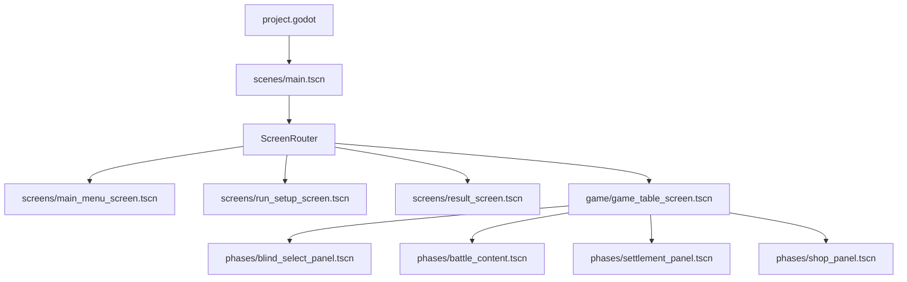

# 项目资源依赖审计报告

> 生成时间：2026-07-15T22:02:24+08:00
> 扫描根目录：`E:\game\PokerRogueCN`
> 范围：排除 `.git/`、Godot 本地缓存 `.godot/` 与 Python `__pycache__/`；包含被 Git 忽略的 `artifacts/`、`output/`。

## 执行摘要

- 扫描文件：**1864**，总大小 **539.6 MiB**。
- 正式运行静态可达：**297** 个文件；动态可达：**222** 个文件。
- 测试专用：**348** 个文件。
- 高置信孤立候选：**0** 个主文件；保守可清理估算（含配套 sidecar）**0 B**。
- 修正历史清单/测试后，Batch C/D 条件候选预计 **3.6 MiB**；这不是本轮删除许可。
- 完全重复：**23** 组、**58** 个冗余副本；近似重复候选：**1611** 对。
- 无效 JSON：**0**；不存在的 `res://` 引用：**21**。

## 当前真实运行入口

- `run/main_scene`：`res://scenes/main.tscn`。
- Autoload：`res://autoload/data_registry.gd`, `res://autoload/game.gd`, `res://autoload/audio_manager.gd`, `res://addons/godot_ai/runtime/game_helper.gd`。
- 全局 Theme：`res://assets/ui/theme/game_theme.tres`。
- 图标：`res://icon.svg`。
- 编辑器插件（DEV_ONLY）：`res://addons/godot_ai/plugin.cfg`。
- `ScreenRouter` 的 HOME / DECK_SELECT / GAME_OVER、VICTORY 分别进入 `scenes/screens/main_menu_screen.tscn`、`run_setup_screen.tscn`、`result_screen.tscn`；STAGE_SELECT / ROUND / SETTLEMENT / SHOP 共用 `scenes/game/game_table_screen.tscn`。
- 统一游戏桌内的阶段内容由 `blind_select_panel.tscn`、`battle_content.tscn`、`settlement_panel.tscn`、`shop_panel.tscn` 承载，属于同一场景常驻子树，而不是四个顶层页面。

## 正式场景依赖图



### 可达正式场景

- `res://scenes/cards/joker_card_view.tscn`
- `res://scenes/cards/playing_card_view.tscn`
- `res://scenes/game/game_hud_panel.tscn`
- `res://scenes/game/game_table_screen.tscn`
- `res://scenes/game/phases/battle_content.tscn`
- `res://scenes/game/phases/blind_select_panel.tscn`
- `res://scenes/game/phases/settlement_panel.tscn`
- `res://scenes/game/phases/shop_panel.tscn`
- `res://scenes/game/stage_card_view.tscn`
- `res://scenes/game/table/consumable_tray.tscn`
- `res://scenes/game/table/deck_area.tscn`
- `res://scenes/game/table/joker_shelf.tscn`
- `res://scenes/main.tscn`
- `res://scenes/screens/main_menu_screen.tscn`
- `res://scenes/screens/result_screen.tscn`
- `res://scenes/screens/run_setup_screen.tscn`
- `res://scenes/shop/shop_offer_card.tscn`
- `res://scenes/ui/card_detail_popup.tscn`
- `res://scenes/ui/deck_select_screen.tscn`
- `res://scenes/ui/floating_score_label.tscn`
- `res://scenes/ui/main_menu_screen.tscn`
- `res://scenes/ui/result_screen.tscn`
- `res://scenes/ui/shared/bottom_sheet_host.tscn`
- `res://scenes/ui/shared/consumable_slot_view.tscn`

## 动态资源依赖

- `scripts/ui/art_resolver.gd` 静态读取 `assets/cards/card_art_manifest.json`；清单内的 `items`、分类 fallback、subtype fallback 与 unknown fallback 均按 `REACHABLE_RUNTIME_DYNAMIC` 传播。
- `scripts/cards/playing_card_view.gd` 以 rank/suit 拼接 `assets/cards/poker/faces/%s_%s.png`；审计器把目录中 52 张 `.png` 及其 `.import` 配对纳入动态运行资源。
- `assets/ui/runtime/generated/jokers/**` 是 ArtResolver 的受保护动态目录族；即使新专属图片暂未写回清单，也标记为动态保留。
- `autoload/data_registry.gd` 读取 `data/**.json` 作为正式数据入口；AudioManager 的 BGM/SFX `preload` 均属于静态运行依赖。
- `ui_asset_catalog.json`、`button_manifest.json`、`asset_normalization.json` 是来源/审计元数据；除非正式代码实际加载，否则不会仅因位于 `runtime/` 就升级为正式运行依赖。

## 文件分类统计（唯一主分类）

| 分类 | 文件数 | 大小 |
|---|---:|---:|
| REACHABLE_RUNTIME_STATIC | 421 | 123.5 MiB |
| REACHABLE_RUNTIME_DYNAMIC | 435 | 11.6 MiB |
| TEST_ONLY | 348 | 41.9 MiB |
| TOOL_ONLY | 8 | 140.4 KiB |
| DEV_ONLY | 224 | 1.1 MiB |
| SOURCE_ONLY | 12 | 20.2 MiB |
| DOC_ONLY | 376 | 334.2 MiB |
| ORPHAN_CANDIDATE | 39 | 6.8 MiB |
| KEEP_UNCERTAIN | 1 | 0 B |

## 状态标签统计（允许重叠）

| 标签 | 文件数 | 大小 |
|---|---:|---:|
| DEV_ONLY | 224 | 1.1 MiB |
| DOC_ONLY | 377 | 334.2 MiB |
| DUPLICATE_CONTENT | 81 | 83.3 MiB |
| KEEP_UNCERTAIN | 1 | 0 B |
| NEAR_DUPLICATE | 291 | 219.1 MiB |
| ORPHAN_CANDIDATE | 39 | 6.8 MiB |
| REACHABLE_RUNTIME_DYNAMIC | 443 | 12.1 MiB |
| REACHABLE_RUNTIME_STATIC | 421 | 123.5 MiB |
| SOURCE_ONLY | 101 | 46.4 MiB |
| TEST_ONLY | 348 | 41.9 MiB |
| TOOL_ONLY | 8 | 140.4 KiB |

## 目录用途与体积

- `scenes/`、`scripts/`、`autoload/`、`data/`：正式代码/数据与测试可达组件混合，必须按图可达性处理。
- `assets/ui/runtime/`：正式切片、动态卡面与若干历史审计 JSON 混合，目录名不能作为使用证据。
- `assets/ui/extracted/` 与 reference 类目录：切片来源及可追溯素材；未被正式场景直接引用的部分标为 SOURCE_ONLY。
- `tests/`：可执行完整性、流程、分辨率与截图验证入口；其依赖与正式运行依赖分开统计。
- `tools/`：生成器、切片器、按钮审计和本扫描器；生成源与工具报告属于 TOOL_ONLY/SOURCE_ONLY。
- `docs/`、`artifacts/`、`output/`：文档、验收截图和生成输出；建议从 Godot 导入范围排除，是否保留由证据价值决定。
- `addons/`、`scenes/debug/`：编辑器插件与调试画廊，归 DEV_ONLY。

### 最大目录 Top 20

| 目录 | 文件数 | 大小 |
|---|---:|---:|
| `artifacts/` | 326 | 309.2 MiB |
| `artifacts/final_scene_review/` | 273 | 241.3 MiB |
| `assets/` | 1076 | 203.5 MiB |
| `assets/ui/` | 898 | 192.4 MiB |
| `artifacts/final_scene_review/resolutions/` | 120 | 154.9 MiB |
| `assets/ui/fonts/` | 4 | 105.9 MiB |
| `assets/ui/extracted/` | 101 | 33.2 MiB |
| `artifacts/final_scene_review/game_table/` | 20 | 26.4 MiB |
| `assets/ui/runtime/` | 599 | 25.7 MiB |
| `artifacts/final_scene_review/components/` | 70 | 24.4 MiB |
| `docs/` | 41 | 22.4 MiB |
| `docs/visual_delayering_phase1/` | 23 | 21.6 MiB |
| `artifacts/ui_review/` | 16 | 21.1 MiB |
| `assets/ui/references/` | 12 | 20.2 MiB |
| `artifacts/button_review/` | 18 | 19.4 MiB |
| `artifacts/scene_refactor/` | 12 | 16.2 MiB |
| `artifacts/final_scene_review/run_setup/` | 10 | 11.8 MiB |
| `docs/visual_delayering_phase1/before/` | 10 | 11.6 MiB |
| `artifacts/visual_delayering_phase1/` | 6 | 11.1 MiB |
| `artifacts/visual_delayering_phase1/after/` | 6 | 11.1 MiB |

### 最大文件 Top 30

| 文件 | 分类 | 大小 |
|---|---|---:|
| `assets/ui/fonts/ChillHuoGothic_F_Bold.otf` | REACHABLE_RUNTIME_STATIC | 54.8 MiB |
| `assets/ui/fonts/ChillHuoGothic_F_ConBold.otf` | REACHABLE_RUNTIME_STATIC | 51.1 MiB |
| `artifacts/final_scene_review/resolutions/home_default_2560x1440.png` | DOC_ONLY | 4.7 MiB |
| `artifacts/final_scene_review/resolutions/result_game_over_2560x1440.png` | DOC_ONLY | 4.1 MiB |
| `artifacts/final_scene_review/resolutions/result_victory_2560x1440.png` | DOC_ONLY | 4.1 MiB |
| `artifacts/final_scene_review/resolutions/shop_default_2560x1440.png` | DOC_ONLY | 3.9 MiB |
| `artifacts/final_scene_review/resolutions/card_detail_long_2560x1440.png` | DOC_ONLY | 3.9 MiB |
| `artifacts/final_scene_review/resolutions/blind_select_default_2560x1440.png` | DOC_ONLY | 3.8 MiB |
| `artifacts/final_scene_review/resolutions/battle_default_2560x1440.png` | DOC_ONLY | 3.8 MiB |
| `artifacts/final_scene_review/resolutions/run_setup_default_2560x1440.png` | DOC_ONLY | 3.6 MiB |
| `artifacts/final_scene_review/resolutions/settlement_complete_2560x1440.png` | DOC_ONLY | 3.6 MiB |
| `assets/ui/references/battle_reference.png` | SOURCE_ONLY | 3.5 MiB |
| `assets/ui/references/home_reference.png` | SOURCE_ONLY | 3.4 MiB |
| `assets/ui/references/settlement_reference.png` | SOURCE_ONLY | 3.4 MiB |
| `assets/ui/references/stage_select_reference.png` | SOURCE_ONLY | 3.4 MiB |
| `assets/ui/references/shop_reference.png` | SOURCE_ONLY | 3.4 MiB |
| `artifacts/final_scene_review/resolutions/result_game_over_2520x1080.png` | DOC_ONLY | 3.3 MiB |
| `artifacts/final_scene_review/resolutions/blind_select_default_2520x1080.png` | DOC_ONLY | 3.3 MiB |
| `artifacts/final_scene_review/resolutions/result_victory_2520x1080.png` | DOC_ONLY | 3.2 MiB |
| `artifacts/final_scene_review/resolutions/shop_default_2520x1080.png` | DOC_ONLY | 3.2 MiB |
| `artifacts/final_scene_review/resolutions/shop_pack_open_2560x1440.png` | DOC_ONLY | 3.2 MiB |
| `assets/ui/references/deck_select_reference.png` | SOURCE_ONLY | 3.1 MiB |
| `artifacts/final_scene_review/resolutions/card_detail_long_2520x1080.png` | DOC_ONLY | 3.1 MiB |
| `artifacts/final_scene_review/resolutions/home_default_2520x1080.png` | DOC_ONLY | 3.1 MiB |
| `artifacts/final_scene_review/resolutions/settlement_complete_2520x1080.png` | DOC_ONLY | 3.0 MiB |
| `artifacts/final_scene_review/resolutions/battle_default_2520x1080.png` | DOC_ONLY | 3.0 MiB |
| `artifacts/ui_review/home.png` | DOC_ONLY | 3.0 MiB |
| `artifacts/final_scene_review/resolutions/home_default_1920x1200.png` | DOC_ONLY | 3.0 MiB |
| `artifacts/final_scene_review/home/home_start_hover_1920x1080.png` | DOC_ONLY | 3.0 MiB |
| `artifacts/final_scene_review/components/ui__main_menu_screen_1920x1080.png` | DOC_ONLY | 3.0 MiB |

## 重点疑点复核

### A. README 旧场景

README 仍引用 4 个已不存在的旧顶层场景；正式路由已经改用统一游戏桌。`tests/test_game_table_scene.gd` 对这 4 个路径做的是“必须不存在”的负向架构断言，不应误报为坏依赖。

### B. 运行目录中的历史按钮报告

- `button_manifest.json` 仍含 **102** 个 `button_style_gallery` 按钮，并引用已删除的 `battle_screen`、`settlement_screen`、`joker_shop_screen`；它由测试读取，但不是正式运行加载入口。
- `asset_normalization.json` 的 `generator` 指向 `tools/button_asset_normalizer.py`，属于 TOOL_ONLY 报告；第二轮应在重新生成测试清单后迁至 `tools/reports/`，而非继续混放在 runtime。

### C. 本机绝对路径清单

- `assets/ASSET_MANIFEST.json`：发现 **54** 个绝对路径文本。
- `assets/ui/extracted/asset_manifest.json`：发现 **116** 个绝对路径文本。
- 两者应改成仓库相对来源标识或可移植 `res://`，但本轮只报告、不改写。

### D. 已知旧运行资源候选

| 文件 | 当前主分类 | 有效引用来源 | 结论 |
|---|---|---|---|
| `assets/ui/runtime/backgrounds/stage_select.png` | TEST_ONLY | `assets/ui/runtime/ui_asset_catalog.json`, `tests/test_asset_integrity.gd` | 未被正式流程使用；仅测试/历史清单保活，Batch A 更新断言后可进入 Batch C |
| `assets/ui/runtime/backgrounds/battle_frame.png` | TEST_ONLY | `assets/ui/runtime/ui_asset_catalog.json`, `tests/test_asset_integrity.gd` | 未被正式流程使用；仅测试/历史清单保活，Batch A 更新断言后可进入 Batch C |
| `assets/ui/runtime/backgrounds/shop.png` | TEST_ONLY | `assets/ui/runtime/ui_asset_catalog.json`, `tests/test_asset_integrity.gd` | 未被正式流程使用；仅测试/历史清单保活，Batch A 更新断言后可进入 Batch C |
| `assets/ui/runtime/panels/battle_hud_full.png` | TEST_ONLY | `assets/ui/runtime/ui_asset_catalog.json`, `tests/test_asset_integrity.gd` | 未被正式流程使用；仅测试/历史清单保活，Batch A 更新断言后可进入 Batch C |
| `assets/ui/runtime/panels/deck_main_panel.png` | TEST_ONLY | `assets/ui/runtime/ui_asset_catalog.json`, `tests/test_asset_integrity.gd` | 未被正式流程使用；仅测试/历史清单保活，Batch A 更新断言后可进入 Batch C |
| `assets/ui/runtime/panels/shop_offers_panel.png` | TEST_ONLY | `assets/ui/runtime/ui_asset_catalog.json`, `tests/test_asset_integrity.gd` | 未被正式流程使用；仅测试/历史清单保活，Batch A 更新断言后可进入 Batch C |
| `assets/ui/runtime/buttons/settlement/claim.png` | TEST_ONLY | `assets/ui/runtime/buttons/asset_normalization.json`, `assets/ui/runtime/buttons/button_manifest.json` | 未被正式流程使用；仅测试/历史清单保活，Batch A 更新断言后可进入 Batch C |

### E. deck_pile_view 组件组

`scenes/cards/deck_pile_view.tscn` 不在正式运行、工具或调试根可达集合；`test_all_production_scenes.gd` 通过目录枚举加载它，因此严格分类是 TEST_ONLY。其脚本只被该场景引用，`.gd.uid` 仅为脚本 sidecar。整组可作为条件 Batch D 候选，但不能计入零引用孤立项。

### F. 共享组件池

| 组件 | 当前主分类 | 说明 |
|---|---|---|
| `scenes/ui/shared/blind_token_view.tscn` | TEST_ONLY | 仅由测试或历史按钮清单保活；先更新测试证据 |
| `scenes/ui/shared/currency_display.tscn` | TEST_ONLY | 仅由测试或历史按钮清单保活；先更新测试证据 |
| `scenes/ui/shared/deck_stack_view.tscn` | TEST_ONLY | 仅由测试或历史按钮清单保活；先更新测试证据 |
| `scenes/ui/shared/empty_card_slot.tscn` | TEST_ONLY | 仅由测试或历史按钮清单保活；先更新测试证据 |
| `scenes/ui/shared/ornate_panel.tscn` | TEST_ONLY | 仅由测试或历史按钮清单保活；先更新测试证据 |
| `scenes/ui/shared/price_plate.tscn` | TEST_ONLY | 仅由测试或历史按钮清单保活；先更新测试证据 |
| `scenes/ui/shared/reward_row.tscn` | TEST_ONLY | 仅由测试或历史按钮清单保活；先更新测试证据 |
| `scenes/ui/shared/section_header.tscn` | TEST_ONLY | 仅由测试或历史按钮清单保活；先更新测试证据 |
| `scenes/ui/shared/textured_button.tscn` | TEST_ONLY | 仅由测试或历史按钮清单保活；先更新测试证据 |

### H. 文档、截图、输出与调试资源

- `docs/`：**22.4 MiB**，包含审计文档、Excel 与视觉分层 before/after 证据；保留高价值文档，但通过 `.gdignore` 排除 Godot 导入。
- `artifacts/`：**309.2 MiB**，为被 `.gitignore` 忽略的本地截图输出；不提交，按需清理或外置。
- `output/`：**2.7 MiB**，为生成输出；迁至 `tools/reports/` 或保持忽略。
- `scenes/debug/button_style_gallery.tscn`：DEV_ONLY；保留时应与正式测试清单解耦，并将 `scenes/debug/` 从生产导出与自动生产场景枚举中排除。


## Theme / StyleBox 审计

- StyleBox 文件总数：**167**。
- 发现任意有效引用：**142**；未发现引用：**25**。
- 内容完全相同：**7** 组 / **41** 个文件。
- 仅 `modulate_color` 不同：**29** 组 / **126** 个文件。
- 同纹理派生按钮族：**30** 族 / **132** 个样式。
- 上述是收敛候选而非删除许可；必须先对照按钮状态、边距、焦点与禁用态回归测试。

## 完全重复文件

- **2.7 MiB × 4**：`artifacts/scene_refactor/game_table_battle.png`, `artifacts/scene_refactor/game_table_blind_select.png`, `artifacts/scene_refactor/game_table_settlement.png`, `artifacts/scene_refactor/game_table_shop.png`
- **2.7 MiB × 2**：`artifacts/final_scene_review/components/screens__result_screen_1920x1080.png`, `artifacts/final_scene_review/components/ui__result_screen_1920x1080.png`
- **2.7 MiB × 2**：`artifacts/final_scene_review/game_table/shop/shop_item_sold_1920x1080.png`, `docs/visual_delayering_phase1/before/shop_item_sold_1920x1080.png`
- **2.7 MiB × 2**：`artifacts/final_scene_review/resolutions/shop_default_1920x1080.png`, `docs/visual_delayering_phase1/before/shop_default_1920x1080.png`
- **2.7 MiB × 2**：`artifacts/final_scene_review/game_table/shop/shop_insufficient_funds_1920x1080.png`, `docs/visual_delayering_phase1/before/shop_insufficient_funds_1920x1080.png`
- **2.6 MiB × 4**：`artifacts/final_scene_review/game_table/battle/battle_discard_disabled_1920x1080.png`, `artifacts/final_scene_review/game_table/battle/battle_play_disabled_1920x1080.png`, `artifacts/final_scene_review/game_table/battle/battle_sort_rank_1920x1080.png`, `artifacts/final_scene_review/resolutions/battle_default_1920x1080.png`
- **2.4 MiB × 6**：`artifacts/final_scene_review/components/screens__run_setup_screen_1920x1080.png`, `artifacts/final_scene_review/components/ui__deck_select_screen_1920x1080.png`, `artifacts/final_scene_review/resolutions/run_setup_default_1920x1080.png`, `artifacts/final_scene_review/run_setup/run_setup_continue_disabled_1920x1080.png`, `artifacts/final_scene_review/run_setup/run_setup_prev_deck_hover_1920x1080.png`, `artifacts/final_scene_review/run_setup/run_setup_start_hover_1920x1080.png`
- **2.2 MiB × 2**：`artifacts/final_scene_review/resolutions/shop_pack_open_1920x1080.png`, `docs/visual_delayering_phase1/before/shop_pack_open_1920x1080.png`
- **1.9 MiB × 2**：`artifacts/visual_delayering_phase1/after/shop_product_hover_1920x1080.png`, `docs/visual_delayering_phase1/after/shop_product_hover_1920x1080.png`
- **1.8 MiB × 2**：`artifacts/visual_delayering_phase1/after/shop_default_1920x1080.png`, `docs/visual_delayering_phase1/after/shop_default_1920x1080.png`
- **1.8 MiB × 2**：`artifacts/visual_delayering_phase1/after/shop_item_sold_1920x1080.png`, `docs/visual_delayering_phase1/after/shop_item_sold_1920x1080.png`
- **1.8 MiB × 2**：`artifacts/visual_delayering_phase1/after/shop_insufficient_funds_1920x1080.png`, `docs/visual_delayering_phase1/after/shop_insufficient_funds_1920x1080.png`
- **1.7 MiB × 2**：`artifacts/visual_delayering_phase1/after/shop_pack_open_1920x1080.png`, `docs/visual_delayering_phase1/after/shop_pack_open_1920x1080.png`
- **1.3 MiB × 2**：`artifacts/final_scene_review/resolutions/shop_default_1280x720.png`, `docs/visual_delayering_phase1/before/shop_default_1280x720.png`
- **475.0 KiB × 2**：`assets/ui/runtime/backgrounds/battle_frame.png`, `assets/ui/runtime/frames/game_table_frame.png`
- **10.3 KiB × 2**：`artifacts/final_scene_review/components/ui__shared__blind_token_view_1920x1080.png`, `artifacts/final_scene_review/components/ui__shared__bottom_sheet_host_1920x1080.png`
- **558 B × 2**：`assets/ui/theme/styles/buttons/deck_select/tab_center/disabled.tres`, `assets/ui/theme/styles/buttons/tab/disabled.tres`
- **555 B × 2**：`assets/ui/theme/styles/buttons/deck_select/tab_center/hover.tres`, `assets/ui/theme/styles/buttons/tab/hover.tres`
- **555 B × 2**：`assets/ui/theme/styles/buttons/deck_select/tab_center/selected_hover.tres`, `assets/ui/theme/styles/buttons/tab/selected_hover.tres`
- **554 B × 2**：`assets/ui/theme/styles/buttons/deck_select/tab_center/pressed.tres`, `assets/ui/theme/styles/buttons/tab/pressed.tres`
- **554 B × 2**：`assets/ui/theme/styles/buttons/deck_select/tab_center/selected.tres`, `assets/ui/theme/styles/buttons/tab/selected.tres`
- **546 B × 2**：`assets/ui/theme/styles/buttons/deck_select/tab_center/normal.tres`, `assets/ui/theme/styles/buttons/tab/normal.tres`
- **478 B × 29**：`assets/ui/theme/styles/buttons/battle/discard/focus.tres`, `assets/ui/theme/styles/buttons/battle/play/focus.tres`, `assets/ui/theme/styles/buttons/battle/sort_rank/focus.tres`, `assets/ui/theme/styles/buttons/battle/sort_suit/focus.tres`, `assets/ui/theme/styles/buttons/danger/focus.tres`, `assets/ui/theme/styles/buttons/deck_select/back/focus.tres`, `assets/ui/theme/styles/buttons/deck_select/start/focus.tres`, `assets/ui/theme/styles/buttons/deck_select/tab_center/focus.tres`, `assets/ui/theme/styles/buttons/deck_select/tab_left/focus.tres`, `assets/ui/theme/styles/buttons/deck_select/tab_right/focus.tres`, `assets/ui/theme/styles/buttons/gold/focus.tres`, `assets/ui/theme/styles/buttons/home/language/focus.tres`, `assets/ui/theme/styles/buttons/home/options/focus.tres`, `assets/ui/theme/styles/buttons/home/quit/focus.tres`, `assets/ui/theme/styles/buttons/home/start/focus.tres`, `assets/ui/theme/styles/buttons/icon/focus.tres`, `assets/ui/theme/styles/buttons/popup/cancel/focus.tres`, `assets/ui/theme/styles/buttons/popup/confirm/focus.tres`, `assets/ui/theme/styles/buttons/red/focus.tres`, `assets/ui/theme/styles/buttons/result/home/focus.tres`, `assets/ui/theme/styles/buttons/result/primary/focus.tres`, `assets/ui/theme/styles/buttons/settlement/continue/focus.tres`, `assets/ui/theme/styles/buttons/shop/buy/focus.tres`, `assets/ui/theme/styles/buttons/shop/next/focus.tres`, `assets/ui/theme/styles/buttons/shop/reroll/focus.tres`, `assets/ui/theme/styles/buttons/small/focus.tres`, `assets/ui/theme/styles/buttons/stage/select/focus.tres`, `assets/ui/theme/styles/buttons/stage/skip/focus.tres`, `assets/ui/theme/styles/buttons/tab/focus.tres`

## 近似重复图片候选

dHash 距离仅用于人工复核，不作为删除依据：
- 距离 0：`artifacts/button_review/home_buttons.png` ↔ `artifacts/final_scene_review/components/screens__main_menu_screen_1920x1080.png`
- 距离 0：`artifacts/button_review/home_buttons.png` ↔ `artifacts/final_scene_review/components/ui__main_menu_screen_1920x1080.png`
- 距离 0：`artifacts/button_review/home_buttons.png` ↔ `artifacts/final_scene_review/home/home_language_hover_1920x1080.png`
- 距离 0：`artifacts/button_review/home_buttons.png` ↔ `artifacts/final_scene_review/home/home_options_hover_1920x1080.png`
- 距离 0：`artifacts/button_review/home_buttons.png` ↔ `artifacts/final_scene_review/home/home_start_hover_1920x1080.png`
- 距离 0：`artifacts/button_review/home_buttons.png` ↔ `artifacts/final_scene_review/resolutions/home_default_1920x1080.png`
- 距离 0：`artifacts/button_review/home_buttons.png` ↔ `artifacts/scene_refactor/home.png`
- 距离 0：`artifacts/button_review/result_buttons.png` ↔ `artifacts/final_scene_review/resolutions/result_victory_1920x1080.png`
- 距离 0：`artifacts/final_scene_review/components/cards__deck_pile_view_1920x1080.png` ↔ `artifacts/final_scene_review/components/shop__shop_offer_card_1920x1080.png`
- 距离 0：`artifacts/final_scene_review/components/cards__deck_pile_view_1920x1080.png` ↔ `artifacts/final_scene_review/components/ui__shared__currency_display_1920x1080.png`
- 距离 0：`artifacts/final_scene_review/components/cards__deck_pile_view_1920x1080.png` ↔ `artifacts/final_scene_review/components/ui__shared__textured_button_1920x1080.png`
- 距离 0：`artifacts/final_scene_review/components/game__game_table_screen_1920x1080.png` ↔ `artifacts/final_scene_review/resolutions/blind_select_default_1920x1080.png`
- 距离 0：`artifacts/final_scene_review/components/game__table__consumable_tray_1920x1080.png` ↔ `artifacts/final_scene_review/components/ui__shared__consumable_slot_view_1920x1080.png`
- 距离 0：`artifacts/final_scene_review/components/game__table__consumable_tray_1920x1080.png` ↔ `artifacts/final_scene_review/components/ui__shared__empty_card_slot_1920x1080.png`
- 距离 0：`artifacts/final_scene_review/components/game__table__consumable_tray_1920x1080.png` ↔ `artifacts/final_scene_review/components/ui__shared__price_plate_1920x1080.png`
- 距离 0：`artifacts/final_scene_review/components/game__table__deck_area_1920x1080.png` ↔ `artifacts/final_scene_review/components/ui__floating_score_label_1920x1080.png`
- 距离 0：`artifacts/final_scene_review/components/game__table__deck_area_1920x1080.png` ↔ `artifacts/final_scene_review/components/ui__shared__reward_row_1920x1080.png`
- 距离 0：`artifacts/final_scene_review/components/screens__main_menu_screen_1920x1080.png` ↔ `artifacts/final_scene_review/components/ui__main_menu_screen_1920x1080.png`
- 距离 0：`artifacts/final_scene_review/components/screens__main_menu_screen_1920x1080.png` ↔ `artifacts/final_scene_review/home/home_language_hover_1920x1080.png`
- 距离 0：`artifacts/final_scene_review/components/screens__main_menu_screen_1920x1080.png` ↔ `artifacts/final_scene_review/home/home_options_hover_1920x1080.png`
- 距离 0：`artifacts/final_scene_review/components/screens__main_menu_screen_1920x1080.png` ↔ `artifacts/final_scene_review/home/home_start_hover_1920x1080.png`
- 距离 0：`artifacts/final_scene_review/components/screens__main_menu_screen_1920x1080.png` ↔ `artifacts/final_scene_review/resolutions/home_default_1920x1080.png`
- 距离 0：`artifacts/final_scene_review/components/screens__main_menu_screen_1920x1080.png` ↔ `artifacts/scene_refactor/home.png`
- 距离 0：`artifacts/final_scene_review/components/screens__result_screen_1920x1080.png` ↔ `artifacts/final_scene_review/resolutions/result_game_over_1920x1080.png`
- 距离 0：`artifacts/final_scene_review/components/screens__run_setup_screen_1920x1080.png` ↔ `artifacts/final_scene_review/run_setup/run_setup_continue_enabled_1920x1080.png`
- 距离 0：`artifacts/final_scene_review/components/shop__shop_offer_card_1920x1080.png` ↔ `artifacts/final_scene_review/components/ui__shared__currency_display_1920x1080.png`
- 距离 0：`artifacts/final_scene_review/components/shop__shop_offer_card_1920x1080.png` ↔ `artifacts/final_scene_review/components/ui__shared__textured_button_1920x1080.png`
- 距离 0：`artifacts/final_scene_review/components/ui__deck_select_screen_1920x1080.png` ↔ `artifacts/final_scene_review/run_setup/run_setup_continue_enabled_1920x1080.png`
- 距离 0：`artifacts/final_scene_review/components/ui__floating_score_label_1920x1080.png` ↔ `artifacts/final_scene_review/components/ui__shared__reward_row_1920x1080.png`
- 距离 0：`artifacts/final_scene_review/components/ui__main_menu_screen_1920x1080.png` ↔ `artifacts/final_scene_review/home/home_language_hover_1920x1080.png`
- 距离 0：`artifacts/final_scene_review/components/ui__main_menu_screen_1920x1080.png` ↔ `artifacts/final_scene_review/home/home_options_hover_1920x1080.png`
- 距离 0：`artifacts/final_scene_review/components/ui__main_menu_screen_1920x1080.png` ↔ `artifacts/final_scene_review/home/home_start_hover_1920x1080.png`
- 距离 0：`artifacts/final_scene_review/components/ui__main_menu_screen_1920x1080.png` ↔ `artifacts/final_scene_review/resolutions/home_default_1920x1080.png`
- 距离 0：`artifacts/final_scene_review/components/ui__main_menu_screen_1920x1080.png` ↔ `artifacts/scene_refactor/home.png`
- 距离 0：`artifacts/final_scene_review/components/ui__result_screen_1920x1080.png` ↔ `artifacts/final_scene_review/resolutions/result_game_over_1920x1080.png`
- 距离 0：`artifacts/final_scene_review/components/ui__shared__consumable_slot_view_1920x1080.png` ↔ `artifacts/final_scene_review/components/ui__shared__empty_card_slot_1920x1080.png`
- 距离 0：`artifacts/final_scene_review/components/ui__shared__consumable_slot_view_1920x1080.png` ↔ `artifacts/final_scene_review/components/ui__shared__price_plate_1920x1080.png`
- 距离 0：`artifacts/final_scene_review/components/ui__shared__currency_display_1920x1080.png` ↔ `artifacts/final_scene_review/components/ui__shared__textured_button_1920x1080.png`
- 距离 0：`artifacts/final_scene_review/components/ui__shared__empty_card_slot_1920x1080.png` ↔ `artifacts/final_scene_review/components/ui__shared__price_plate_1920x1080.png`
- 距离 0：`artifacts/final_scene_review/game_table/battle/battle_discard_disabled_1920x1080.png` ↔ `artifacts/final_scene_review/game_table/battle/battle_one_selected_1920x1080.png`
- 距离 0：`artifacts/final_scene_review/game_table/battle/battle_one_selected_1920x1080.png` ↔ `artifacts/final_scene_review/game_table/battle/battle_play_disabled_1920x1080.png`
- 距离 0：`artifacts/final_scene_review/game_table/battle/battle_one_selected_1920x1080.png` ↔ `artifacts/final_scene_review/game_table/battle/battle_sort_rank_1920x1080.png`
- 距离 0：`artifacts/final_scene_review/game_table/battle/battle_one_selected_1920x1080.png` ↔ `artifacts/final_scene_review/resolutions/battle_default_1920x1080.png`
- 距离 0：`artifacts/final_scene_review/game_table/shop/shop_item_sold_1920x1080.png` ↔ `artifacts/final_scene_review/resolutions/shop_default_1920x1080.png`
- 距离 0：`artifacts/final_scene_review/game_table/shop/shop_item_sold_1920x1080.png` ↔ `docs/visual_delayering_phase1/before/shop_default_1920x1080.png`
- 距离 0：`artifacts/final_scene_review/home/home_language_hover_1920x1080.png` ↔ `artifacts/final_scene_review/home/home_options_hover_1920x1080.png`
- 距离 0：`artifacts/final_scene_review/home/home_language_hover_1920x1080.png` ↔ `artifacts/final_scene_review/home/home_start_hover_1920x1080.png`
- 距离 0：`artifacts/final_scene_review/home/home_language_hover_1920x1080.png` ↔ `artifacts/final_scene_review/resolutions/home_default_1920x1080.png`
- 距离 0：`artifacts/final_scene_review/home/home_language_hover_1920x1080.png` ↔ `artifacts/scene_refactor/home.png`
- 距离 0：`artifacts/final_scene_review/home/home_options_hover_1920x1080.png` ↔ `artifacts/final_scene_review/home/home_start_hover_1920x1080.png`
- 距离 0：`artifacts/final_scene_review/home/home_options_hover_1920x1080.png` ↔ `artifacts/final_scene_review/resolutions/home_default_1920x1080.png`
- 距离 0：`artifacts/final_scene_review/home/home_options_hover_1920x1080.png` ↔ `artifacts/scene_refactor/home.png`
- 距离 0：`artifacts/final_scene_review/home/home_start_hover_1920x1080.png` ↔ `artifacts/final_scene_review/resolutions/home_default_1920x1080.png`
- 距离 0：`artifacts/final_scene_review/home/home_start_hover_1920x1080.png` ↔ `artifacts/scene_refactor/home.png`
- 距离 0：`artifacts/final_scene_review/popups/card_detail_planet_1920x1080.png` ↔ `artifacts/final_scene_review/popups/card_detail_tarot_1920x1080.png`
- 距离 0：`artifacts/final_scene_review/resolutions/home_default_1920x1080.png` ↔ `artifacts/scene_refactor/home.png`
- 距离 0：`artifacts/final_scene_review/resolutions/run_setup_default_1920x1080.png` ↔ `artifacts/final_scene_review/run_setup/run_setup_continue_enabled_1920x1080.png`
- 距离 0：`artifacts/final_scene_review/resolutions/shop_default_1920x1080.png` ↔ `docs/visual_delayering_phase1/before/shop_item_sold_1920x1080.png`
- 距离 0：`artifacts/final_scene_review/run_setup/run_setup_continue_disabled_1920x1080.png` ↔ `artifacts/final_scene_review/run_setup/run_setup_continue_enabled_1920x1080.png`
- 距离 0：`artifacts/final_scene_review/run_setup/run_setup_continue_enabled_1920x1080.png` ↔ `artifacts/final_scene_review/run_setup/run_setup_prev_deck_hover_1920x1080.png`
- 距离 0：`artifacts/final_scene_review/run_setup/run_setup_continue_enabled_1920x1080.png` ↔ `artifacts/final_scene_review/run_setup/run_setup_start_hover_1920x1080.png`
- 距离 0：`artifacts/visual_delayering_phase1/after/shop_default_1920x1080.png` ↔ `artifacts/visual_delayering_phase1/after/shop_product_hover_1920x1080.png`
- 距离 0：`artifacts/visual_delayering_phase1/after/shop_default_1920x1080.png` ↔ `docs/visual_delayering_phase1/after/shop_product_hover_1920x1080.png`
- 距离 0：`artifacts/visual_delayering_phase1/after/shop_product_hover_1920x1080.png` ↔ `docs/visual_delayering_phase1/after/shop_default_1920x1080.png`
- 距离 0：`assets/cards/poker/faces/2_clubs.png` ↔ `assets/cards/poker/faces/4_clubs.png`
- 距离 0：`assets/cards/poker/faces/2_clubs.png` ↔ `assets/cards/poker/faces/7_clubs.png`
- 距离 0：`assets/cards/poker/faces/2_diamonds.png` ↔ `assets/cards/poker/faces/2_spades.png`
- 距离 0：`assets/cards/poker/faces/2_diamonds.png` ↔ `assets/cards/poker/faces/3_diamonds.png`
- 距离 0：`assets/cards/poker/faces/2_diamonds.png` ↔ `assets/cards/poker/faces/3_spades.png`
- 距离 0：`assets/cards/poker/faces/2_diamonds.png` ↔ `assets/cards/poker/faces/4_diamonds.png`
- 距离 0：`assets/cards/poker/faces/2_diamonds.png` ↔ `assets/cards/poker/faces/4_spades.png`
- 距离 0：`assets/cards/poker/faces/2_diamonds.png` ↔ `assets/cards/poker/faces/5_diamonds.png`
- 距离 0：`assets/cards/poker/faces/2_diamonds.png` ↔ `assets/cards/poker/faces/5_spades.png`
- 距离 0：`assets/cards/poker/faces/2_diamonds.png` ↔ `assets/cards/poker/faces/6_diamonds.png`
- 距离 0：`assets/cards/poker/faces/2_diamonds.png` ↔ `assets/cards/poker/faces/7_diamonds.png`
- 距离 0：`assets/cards/poker/faces/2_diamonds.png` ↔ `assets/cards/poker/faces/7_spades.png`
- 距离 0：`assets/cards/poker/faces/2_diamonds.png` ↔ `assets/cards/poker/faces/8_diamonds.png`
- 距离 0：`assets/cards/poker/faces/2_diamonds.png` ↔ `assets/cards/poker/faces/9_diamonds.png`
- 距离 0：`assets/cards/poker/faces/2_diamonds.png` ↔ `assets/cards/poker/faces/9_spades.png`
- 距离 0：`assets/cards/poker/faces/2_diamonds.png` ↔ `assets/cards/poker/faces/a_diamonds.png`
- 距离 0：`assets/cards/poker/faces/2_diamonds.png` ↔ `assets/cards/poker/faces/a_spades.png`
- 距离 0：`assets/cards/poker/faces/2_diamonds.png` ↔ `assets/cards/poker/faces/j_diamonds.png`
- 距离 0：`assets/cards/poker/faces/2_diamonds.png` ↔ `assets/cards/poker/faces/j_spades.png`
- 距离 0：`assets/cards/poker/faces/2_diamonds.png` ↔ `assets/cards/poker/faces/k_diamonds.png`
- 距离 0：`assets/cards/poker/faces/2_diamonds.png` ↔ `assets/cards/poker/faces/k_spades.png`
- 距离 0：`assets/cards/poker/faces/2_diamonds.png` ↔ `assets/cards/poker/faces/q_spades.png`
- 距离 0：`assets/cards/poker/faces/2_hearts.png` ↔ `assets/cards/poker/faces/3_hearts.png`
- 距离 0：`assets/cards/poker/faces/2_hearts.png` ↔ `assets/cards/poker/faces/4_hearts.png`
- 距离 0：`assets/cards/poker/faces/2_hearts.png` ↔ `assets/cards/poker/faces/5_hearts.png`
- 距离 0：`assets/cards/poker/faces/2_hearts.png` ↔ `assets/cards/poker/faces/6_hearts.png`
- 距离 0：`assets/cards/poker/faces/2_hearts.png` ↔ `assets/cards/poker/faces/7_hearts.png`
- 距离 0：`assets/cards/poker/faces/2_hearts.png` ↔ `assets/cards/poker/faces/8_hearts.png`
- 距离 0：`assets/cards/poker/faces/2_hearts.png` ↔ `assets/cards/poker/faces/9_hearts.png`
- 距离 0：`assets/cards/poker/faces/2_hearts.png` ↔ `assets/cards/poker/faces/a_hearts.png`
- 距离 0：`assets/cards/poker/faces/2_spades.png` ↔ `assets/cards/poker/faces/3_diamonds.png`
- 距离 0：`assets/cards/poker/faces/2_spades.png` ↔ `assets/cards/poker/faces/3_spades.png`
- 距离 0：`assets/cards/poker/faces/2_spades.png` ↔ `assets/cards/poker/faces/4_diamonds.png`
- 距离 0：`assets/cards/poker/faces/2_spades.png` ↔ `assets/cards/poker/faces/4_spades.png`
- 距离 0：`assets/cards/poker/faces/2_spades.png` ↔ `assets/cards/poker/faces/5_diamonds.png`
- 距离 0：`assets/cards/poker/faces/2_spades.png` ↔ `assets/cards/poker/faces/5_spades.png`

## 过时或不存在的引用

- `README.md` → `res://scenes/game/battle_screen.tscn`（literal）
- `README.md` → `res://scenes/game/settlement_screen.tscn`（literal）
- `README.md` → `res://scenes/game/stage_select_screen.tscn`（literal）
- `README.md` → `res://scenes/shop/joker_shop_screen.tscn`（literal）
- `addons/godot_ai/plugin.gd` → `res://addons/godot_ai/runtime/logger_loader.gd`（literal）
- `addons/godot_ai/plugin.gd` → `res://addons/godot_ai/runtime/logger_loader.gd.uid`（literal）
- `addons/godot_ai/plugin.gd` → `res://addons/godot_ai/runtime/loggers`（literal）
- `addons/godot_ai/plugin.gd` → `res://addons/godot_ai/testing/loggers`（literal）
- `addons/godot_ai/plugin.gd` → `res://addons/godot_ai/testing/script_error_capture_loader.gd`（loader_literal）
- `addons/godot_ai/plugin.gd` → `res://addons/godot_ai/testing/script_error_capture_loader.gd.uid`（loader_literal）
- `addons/godot_ai/runtime/editor_logger.gd` → `res://addons/godot_ai/foo.gd`（literal）
- `addons/godot_ai/runtime/editor_logger.gd` → `res://does/not/exist.tres`（literal）
- `addons/godot_ai/testing/test_suite.gd` → `res://game/arena.gd`（literal）
- `addons/godot_ai/utils/path_validator.gd` → `res://override.cfg`（literal）
- `addons/godot_ai/utils/scene_path.gd` → `res://main.tscn`（literal）
- `assets/ui/runtime/buttons/button_manifest.json` → `res://scenes/game/battle_screen.tscn`（json_metadata）
- `assets/ui/runtime/buttons/button_manifest.json` → `res://scenes/game/settlement_screen.tscn`（json_metadata）
- `assets/ui/runtime/buttons/button_manifest.json` → `res://scenes/shop/joker_shop_screen.tscn`（json_metadata）
- `docs/button_audit.md` → `res://scenes/game/battle_screen.tscn`（literal）
- `docs/button_audit.md` → `res://scenes/game/settlement_screen.tscn`（literal）
- `docs/button_audit.md` → `res://scenes/shop/joker_shop_screen.tscn`（literal）

## 本机绝对路径

- `README.md`：`D:\Godot\Godot_v4.6.2-stable_win64_console.exe --path . --headless -s res://tests/test_asset_integrity.gd`
- `README.md`：`D:\Godot\Godot_v4.6.2-stable_win64_console.exe --path . --headless -s res://tests/test_ui_resolutions.gd`
- `README.md`：`D:\Godot\Godot_v4.6.2-stable_win64_console.exe --path . --headless res://tests/smoke_run.tscn`
- `addons/godot_ai/clients/_manual_command.gd`：`C:\Users\foo\uvx.exe`
- `addons/godot_ai/clients/_manual_command.gd`：`C:\Users\foo\uvx.exe` would otherwise be`
- `addons/godot_ai/utils/port_resolver.gd`：`C:/Windows`
- `assets/ASSET_MANIFEST.json`：`E:/game/小丑牌素材透明底/关卡页面/ChatGPT Image 2026年7月9日 21_36_47 (1).png`
- `assets/ASSET_MANIFEST.json`：`E:/game/小丑牌素材透明底/关卡页面/ChatGPT Image 2026年7月9日 21_37_34 (1).png`
- `assets/ASSET_MANIFEST.json`：`E:/game/小丑牌素材透明底/关卡页面/ChatGPT Image 2026年7月9日 21_37_34 (2).png`
- `assets/ASSET_MANIFEST.json`：`E:/game/小丑牌素材透明底/关卡页面/ChatGPT Image 2026年7月9日 21_37_34 (3).png`
- `assets/ASSET_MANIFEST.json`：`E:/game/小丑牌素材透明底/关卡页面/ChatGPT Image 2026年7月9日 21_37_34 (4).png`
- `assets/ASSET_MANIFEST.json`：`E:/game/小丑牌素材透明底/关卡页面/ChatGPT Image 2026年7月9日 21_37_34 (5).png`
- `assets/ASSET_MANIFEST.json`：`E:/game/小丑牌素材透明底/关卡页面/ChatGPT Image 2026年7月9日 21_37_34 (6).png`
- `assets/ASSET_MANIFEST.json`：`E:/game/小丑牌素材透明底/关卡页面/ChatGPT Image 2026年7月9日 21_37_34 (7).png`
- `assets/ASSET_MANIFEST.json`：`E:/game/小丑牌素材透明底/关卡页面/ChatGPT Image 2026年7月9日 21_37_34 (8).png`
- `assets/ASSET_MANIFEST.json`：`E:/game/小丑牌素材透明底/关卡页面/ChatGPT Image 2026年7月9日 21_37_34 (9).png`
- `assets/ASSET_MANIFEST.json`：`E:/game/小丑牌素材透明底/出牌页面/ChatGPT Image 2026年7月9日 21_35_36.png`
- `assets/ASSET_MANIFEST.json`：`E:/game/小丑牌素材透明底/出牌页面/ChatGPT Image 2026年7月9日 21_35_51 (2).png`
- `assets/ASSET_MANIFEST.json`：`E:/game/小丑牌素材透明底/出牌页面/ChatGPT Image 2026年7月9日 21_35_51 (3).png`
- `assets/ASSET_MANIFEST.json`：`E:/game/小丑牌素材透明底/出牌页面/ChatGPT Image 2026年7月9日 21_35_51 (4).png`
- `assets/ASSET_MANIFEST.json`：`E:/game/小丑牌素材透明底/出牌页面/ChatGPT Image 2026年7月9日 21_35_51 (5).png`
- `assets/ASSET_MANIFEST.json`：`E:/game/小丑牌素材透明底/出牌页面/ChatGPT Image 2026年7月9日 21_35_51 (6).png`
- `assets/ASSET_MANIFEST.json`：`E:/game/小丑牌素材透明底/出牌页面/ChatGPT Image 2026年7月9日 21_35_51 (7).png`
- `assets/ASSET_MANIFEST.json`：`E:/game/小丑牌素材透明底/出牌页面/ChatGPT Image 2026年7月9日 21_35_52 (8).png`
- `assets/ASSET_MANIFEST.json`：`E:/game/小丑牌素材透明底/出牌页面/ChatGPT Image 2026年7月9日 21_36_06 (2).png`
- `assets/ASSET_MANIFEST.json`：`E:/game/小丑牌素材透明底/出牌页面/ChatGPT Image 2026年7月9日 21_36_06 (3).png`
- `assets/ASSET_MANIFEST.json`：`E:/game/小丑牌素材透明底/出牌页面/ChatGPT Image 2026年7月9日 21_36_07 (4).png`
- `assets/ASSET_MANIFEST.json`：`E:/game/小丑牌素材透明底/出牌页面/ChatGPT Image 2026年7月9日 21_36_07 (5).png`
- `assets/ASSET_MANIFEST.json`：`E:/game/小丑牌素材透明底/出牌页面/ChatGPT Image 2026年7月9日 21_36_30 (1).png`
- `assets/ASSET_MANIFEST.json`：`E:/game/小丑牌素材透明底/出牌页面/ChatGPT Image 2026年7月9日 21_36_30 (2).png`
- `assets/ASSET_MANIFEST.json`：`E:/game/小丑牌素材透明底/出牌页面/ChatGPT Image 2026年7月9日 21_36_30 (3).png`
- `assets/ASSET_MANIFEST.json`：`E:/game/小丑牌素材透明底/出牌页面/ChatGPT Image 2026年7月9日 21_36_30 (4).png`
- `assets/ASSET_MANIFEST.json`：`E:/game/小丑牌素材透明底/出牌页面/ChatGPT Image 2026年7月9日 21_36_30 (5).png`
- `assets/ASSET_MANIFEST.json`：`E:/game/小丑牌素材透明底/出牌页面/ChatGPT Image 2026年7月9日 21_36_30 (6).png`
- `assets/ASSET_MANIFEST.json`：`E:/game/小丑牌素材透明底/商店/ChatGPT Image 2026年7月9日 21_36_47 (2).png`
- `assets/ASSET_MANIFEST.json`：`E:/game/小丑牌素材透明底/商店/ChatGPT Image 2026年7月9日 21_37_47 (1).png`
- `assets/ASSET_MANIFEST.json`：`E:/game/小丑牌素材透明底/商店/ChatGPT Image 2026年7月9日 21_37_47 (2).png`
- `assets/ASSET_MANIFEST.json`：`E:/game/小丑牌素材透明底/商店/ChatGPT Image 2026年7月9日 21_37_47 (3).png`
- `assets/ASSET_MANIFEST.json`：`E:/game/小丑牌素材透明底/商店/ChatGPT Image 2026年7月9日 21_37_47 (4).png`
- `assets/ASSET_MANIFEST.json`：`E:/game/小丑牌素材透明底/商店/ChatGPT Image 2026年7月9日 21_37_47 (5).png`
- `assets/ASSET_MANIFEST.json`：`E:/game/小丑牌素材透明底/商店/ChatGPT Image 2026年7月9日 21_37_47 (6).png`
- `assets/ASSET_MANIFEST.json`：`E:/game/小丑牌素材透明底/寒蝉活黑体/ChillHuoGothic_F_Bold.otf`
- `assets/ASSET_MANIFEST.json`：`E:/game/小丑牌素材透明底/寒蝉活黑体/ChillHuoGothic_F_ConBold.otf`
- `assets/ASSET_MANIFEST.json`：`E:/game/小丑牌素材透明底/扑克牌/ChatGPT Image 2026年7月9日 21_34_58.png`
- `assets/ASSET_MANIFEST.json`：`E:/game/小丑牌素材透明底/扑克牌/ChatGPT Image 2026年7月9日 21_35_12.png`
- `assets/ASSET_MANIFEST.json`：`E:/game/小丑牌素材透明底/扑克牌/ChatGPT Image 2026年7月9日 21_35_26.png`
- `assets/ASSET_MANIFEST.json`：`E:/game/小丑牌素材透明底/扑克牌/ChatGPT Image 2026年7月9日 21_36_36.png`
- `assets/ASSET_MANIFEST.json`：`E:/game/小丑牌素材透明底/结算页面/ChatGPT Image 2026年7月9日 21_36_47 (3).png`
- `assets/ASSET_MANIFEST.json`：`E:/game/小丑牌素材透明底/结算页面/ChatGPT Image 2026年7月9日 21_38_08.png`
- `assets/ASSET_MANIFEST.json`：`E:/game/小丑牌素材透明底/选牌颜色/ChatGPT Image 2026年7月9日 21_36_47 (4).png`
- `assets/ASSET_MANIFEST.json`：`E:/game/小丑牌素材透明底/选牌颜色/ChatGPT Image 2026年7月9日 21_37_59.png`
- `assets/ASSET_MANIFEST.json`：`E:/game/小丑牌素材透明底/首页/ChatGPT Image 2026年7月9日 21_34_34.png`
- `assets/ASSET_MANIFEST.json`：`E:/game/小丑牌素材透明底/首页/ChatGPT Image 2026年7月9日 21_34_43 (1).png`
- `assets/ASSET_MANIFEST.json`：`E:/game/小丑牌素材透明底/首页/ChatGPT Image 2026年7月9日 21_34_44 (2).png`
- `assets/ASSET_MANIFEST.json`：`E:/game/小丑牌素材透明底/首页/ChatGPT Image 2026年7月9日 21_34_44 (3).png`
- `assets/ASSET_MANIFEST.json`：`E:/game/小丑牌素材透明底/首页/ChatGPT Image 2026年7月9日 21_34_44 (4).png`
- `assets/ASSET_MANIFEST.json`：`E:/game/小丑牌素材透明底/首页/ChatGPT Image 2026年7月9日 21_34_44 (5).png`
- `assets/ASSET_MANIFEST.json`：`E:/game/小丑牌素材透明底/首页/ChatGPT Image 2026年7月9日 21_34_44 (6).png`
- `assets/ASSET_MANIFEST.json`：`E:/game/小丑牌素材透明底/首页/ChatGPT Image 2026年7月9日 21_34_44 (7).png`
- `assets/ASSET_MANIFEST.json`：`E:/game/小丑牌素材透明底/首页/ChatGPT Image 2026年7月9日 21_34_44 (8).png`
- `assets/ui/extracted/asset_manifest.json`：`E:\\game\\PokerRogueCN\\assets\\ui\\extracted\\battle\\battle_action_buttons.png`
- `assets/ui/extracted/asset_manifest.json`：`E:\\game\\PokerRogueCN\\assets\\ui\\extracted\\battle\\battle_background_frame.png`
- `assets/ui/extracted/asset_manifest.json`：`E:\\game\\PokerRogueCN\\assets\\ui\\extracted\\battle\\battle_card_slots.png`
- `assets/ui/extracted/asset_manifest.json`：`E:\\game\\PokerRogueCN\\assets\\ui\\extracted\\battle\\battle_compact_hud_parts.png`
- `assets/ui/extracted/asset_manifest.json`：`E:\\game\\PokerRogueCN\\assets\\ui\\extracted\\battle\\battle_deck_area.png`
- `assets/ui/extracted/asset_manifest.json`：`E:\\game\\PokerRogueCN\\assets\\ui\\extracted\\battle\\battle_hud_panel_and_buttons.png`
- `assets/ui/extracted/asset_manifest.json`：`E:\\game\\PokerRogueCN\\assets\\ui\\extracted\\battle\\battle_left_hud.png`
- `assets/ui/extracted/asset_manifest.json`：`E:\\game\\PokerRogueCN\\assets\\ui\\extracted\\battle\\battle_score_text.png`
- `assets/ui/extracted/asset_manifest.json`：`E:\\game\\PokerRogueCN\\assets\\ui\\extracted\\battle\\battle_text_sprites.png`
- `assets/ui/extracted/asset_manifest.json`：`E:\\game\\PokerRogueCN\\assets\\ui\\extracted\\battle\\battle_title_bar.png`
- `assets/ui/extracted/asset_manifest.json`：`E:\\game\\PokerRogueCN\\assets\\ui\\extracted\\battle\\battle_tokens.png`
- `assets/ui/extracted/asset_manifest.json`：`E:\\game\\PokerRogueCN\\assets\\ui\\extracted\\battle\\button_gold_large.png`
- `assets/ui/extracted/asset_manifest.json`：`E:\\game\\PokerRogueCN\\assets\\ui\\extracted\\battle\\button_gold_small.png`
- `assets/ui/extracted/asset_manifest.json`：`E:\\game\\PokerRogueCN\\assets\\ui\\extracted\\battle\\button_red_large.png`
- `assets/ui/extracted/asset_manifest.json`：`E:\\game\\PokerRogueCN\\assets\\ui\\extracted\\battle\\button_red_small.png`
- `assets/ui/extracted/asset_manifest.json`：`E:\\game\\PokerRogueCN\\assets\\ui\\extracted\\battle\\button_text_labels.png`
- `assets/ui/extracted/asset_manifest.json`：`E:\\game\\PokerRogueCN\\assets\\ui\\extracted\\battle\\suit_icons_small.png`
- `assets/ui/extracted/asset_manifest.json`：`E:\\game\\PokerRogueCN\\assets\\ui\\extracted\\cards\\blank_card_face.png`
- `assets/ui/extracted/asset_manifest.json`：`E:\\game\\PokerRogueCN\\assets\\ui\\extracted\\cards\\rank_symbols_dark.png`
- `assets/ui/extracted/asset_manifest.json`：`E:\\game\\PokerRogueCN\\assets\\ui\\extracted\\cards\\rank_symbols_red.png`
- `assets/ui/extracted/asset_manifest.json`：`E:\\game\\PokerRogueCN\\assets\\ui\\extracted\\cards\\suit_symbols.png`
- `assets/ui/extracted/asset_manifest.json`：`E:\\game\\PokerRogueCN\\assets\\ui\\extracted\\deck_select\\deck_select_parts.png`
- `assets/ui/extracted/asset_manifest.json`：`E:\\game\\PokerRogueCN\\assets\\ui\\extracted\\home\\background_table.png`
- `assets/ui/extracted/asset_manifest.json`：`E:\\game\\PokerRogueCN\\assets\\ui\\extracted\\home\\hud_corner_bits.png`
- `assets/ui/extracted/asset_manifest.json`：`E:\\game\\PokerRogueCN\\assets\\ui\\extracted\\home\\joker_pile.png`
- `assets/ui/extracted/asset_manifest.json`：`E:\\game\\PokerRogueCN\\assets\\ui\\extracted\\home\\menu_button_language.png`
- `assets/ui/extracted/asset_manifest.json`：`E:\\game\\PokerRogueCN\\assets\\ui\\extracted\\home\\menu_button_quit.png`
- `assets/ui/extracted/asset_manifest.json`：`E:\\game\\PokerRogueCN\\assets\\ui\\extracted\\home\\menu_button_settings.png`
- `assets/ui/extracted/asset_manifest.json`：`E:\\game\\PokerRogueCN\\assets\\ui\\extracted\\home\\menu_button_stack.png`
- `assets/ui/extracted/asset_manifest.json`：`E:\\game\\PokerRogueCN\\assets\\ui\\extracted\\home\\menu_button_stack.png#language`
- `assets/ui/extracted/asset_manifest.json`：`E:\\game\\PokerRogueCN\\assets\\ui\\extracted\\home\\menu_button_stack.png#quit`
- `assets/ui/extracted/asset_manifest.json`：`E:\\game\\PokerRogueCN\\assets\\ui\\extracted\\home\\menu_button_stack.png#settings`
- `assets/ui/extracted/asset_manifest.json`：`E:\\game\\PokerRogueCN\\assets\\ui\\extracted\\home\\menu_button_stack.png#start`
- `assets/ui/extracted/asset_manifest.json`：`E:\\game\\PokerRogueCN\\assets\\ui\\extracted\\home\\menu_button_start.png`
- `assets/ui/extracted/asset_manifest.json`：`E:\\game\\PokerRogueCN\\assets\\ui\\extracted\\home\\menu_text_stack.png`
- `assets/ui/extracted/asset_manifest.json`：`E:\\game\\PokerRogueCN\\assets\\ui\\extracted\\home\\ornate_frame.png`
- `assets/ui/extracted/asset_manifest.json`：`E:\\game\\PokerRogueCN\\assets\\ui\\extracted\\home\\title_panel.png`
- `assets/ui/extracted/asset_manifest.json`：`E:\\game\\PokerRogueCN\\assets\\ui\\extracted\\home\\title_text.png`
- `assets/ui/extracted/asset_manifest.json`：`E:\\game\\PokerRogueCN\\assets\\ui\\extracted\\settlement\\settlement_parts.png`
- `assets/ui/extracted/asset_manifest.json`：`E:\\game\\PokerRogueCN\\assets\\ui\\extracted\\shop\\shop_background.png`
- `assets/ui/extracted/asset_manifest.json`：`E:\\game\\PokerRogueCN\\assets\\ui\\extracted\\shop\\shop_button_bars.png`
- `assets/ui/extracted/asset_manifest.json`：`E:\\game\\PokerRogueCN\\assets\\ui\\extracted\\shop\\shop_cards_packs.png`
- `assets/ui/extracted/asset_manifest.json`：`E:\\game\\PokerRogueCN\\assets\\ui\\extracted\\shop\\shop_curtains_coins.png`
- `assets/ui/extracted/asset_manifest.json`：`E:\\game\\PokerRogueCN\\assets\\ui\\extracted\\shop\\shop_frame_panels.png`
- `assets/ui/extracted/asset_manifest.json`：`E:\\game\\PokerRogueCN\\assets\\ui\\extracted\\shop\\shop_text_labels.png`
- `assets/ui/extracted/asset_manifest.json`：`E:\\game\\PokerRogueCN\\assets\\ui\\extracted\\stage_select\\stage_background.png`
- `assets/ui/extracted/asset_manifest.json`：`E:\\game\\PokerRogueCN\\assets\\ui\\extracted\\stage_select\\stage_buttons.png`
- `assets/ui/extracted/asset_manifest.json`：`E:\\game\\PokerRogueCN\\assets\\ui\\extracted\\stage_select\\stage_card_active.png`
- `assets/ui/extracted/asset_manifest.json`：`E:\\game\\PokerRogueCN\\assets\\ui\\extracted\\stage_select\\stage_card_locked.png`
- `assets/ui/extracted/asset_manifest.json`：`E:\\game\\PokerRogueCN\\assets\\ui\\extracted\\stage_select\\stage_card_next.png`
- `assets/ui/extracted/asset_manifest.json`：`E:\\game\\PokerRogueCN\\assets\\ui\\extracted\\stage_select\\stage_text_group.png`
- `assets/ui/extracted/asset_manifest.json`：`E:\\game\\PokerRogueCN\\assets\\ui\\extracted\\stage_select\\stage_title_banner.png`
- `assets/ui/extracted/asset_manifest.json`：`E:\\game\\PokerRogueCN\\assets\\ui\\extracted\\stage_select\\stage_title_text.png`
- `assets/ui/extracted/asset_manifest.json`：`E:\\game\\PokerRogueCN\\assets\\ui\\extracted\\stage_select\\stage_tokens.png`
- `assets/ui/extracted/asset_manifest.json`：`E:\\game\\PokerRogueCN\\assets\\ui\\fonts\\ChillHuoGothic_F_Bold.otf`
- `assets/ui/extracted/asset_manifest.json`：`E:\\game\\PokerRogueCN\\assets\\ui\\fonts\\ChillHuoGothic_F_ConBold.otf`
- `assets/ui/extracted/asset_manifest.json`：`E:\\game\\PokerRogueCN\\assets\\ui\\references\\battle_reference.png`
- `assets/ui/extracted/asset_manifest.json`：`E:\\game\\PokerRogueCN\\assets\\ui\\references\\deck_select_reference.png`
- `assets/ui/extracted/asset_manifest.json`：`E:\\game\\PokerRogueCN\\assets\\ui\\references\\home_reference.png`
- `assets/ui/extracted/asset_manifest.json`：`E:\\game\\PokerRogueCN\\assets\\ui\\references\\settlement_reference.png`
- `assets/ui/extracted/asset_manifest.json`：`E:\\game\\PokerRogueCN\\assets\\ui\\references\\shop_reference.png`
- `assets/ui/extracted/asset_manifest.json`：`E:\\game\\PokerRogueCN\\assets\\ui\\references\\stage_select_reference.png`
- `assets/ui/extracted/asset_manifest.json`：`E:\\game\\小丑牌素材透明底\\关卡页面\\ChatGPT Image 2026年7月9日 21_36_47 (1).png`
- `assets/ui/extracted/asset_manifest.json`：`E:\\game\\小丑牌素材透明底\\关卡页面\\ChatGPT Image 2026年7月9日 21_37_34 (1).png`
- `assets/ui/extracted/asset_manifest.json`：`E:\\game\\小丑牌素材透明底\\关卡页面\\ChatGPT Image 2026年7月9日 21_37_34 (2).png`
- `assets/ui/extracted/asset_manifest.json`：`E:\\game\\小丑牌素材透明底\\关卡页面\\ChatGPT Image 2026年7月9日 21_37_34 (3).png`
- `assets/ui/extracted/asset_manifest.json`：`E:\\game\\小丑牌素材透明底\\关卡页面\\ChatGPT Image 2026年7月9日 21_37_34 (4).png`
- `assets/ui/extracted/asset_manifest.json`：`E:\\game\\小丑牌素材透明底\\关卡页面\\ChatGPT Image 2026年7月9日 21_37_34 (5).png`
- `assets/ui/extracted/asset_manifest.json`：`E:\\game\\小丑牌素材透明底\\关卡页面\\ChatGPT Image 2026年7月9日 21_37_34 (6).png`
- `assets/ui/extracted/asset_manifest.json`：`E:\\game\\小丑牌素材透明底\\关卡页面\\ChatGPT Image 2026年7月9日 21_37_34 (7).png`
- `assets/ui/extracted/asset_manifest.json`：`E:\\game\\小丑牌素材透明底\\关卡页面\\ChatGPT Image 2026年7月9日 21_37_34 (8).png`
- `assets/ui/extracted/asset_manifest.json`：`E:\\game\\小丑牌素材透明底\\关卡页面\\ChatGPT Image 2026年7月9日 21_37_34 (9).png`
- `assets/ui/extracted/asset_manifest.json`：`E:\\game\\小丑牌素材透明底\\出牌页面\\ChatGPT Image 2026年7月9日 21_35_36.png`
- `assets/ui/extracted/asset_manifest.json`：`E:\\game\\小丑牌素材透明底\\出牌页面\\ChatGPT Image 2026年7月9日 21_35_51 (2).png`
- `assets/ui/extracted/asset_manifest.json`：`E:\\game\\小丑牌素材透明底\\出牌页面\\ChatGPT Image 2026年7月9日 21_35_51 (3).png`
- `assets/ui/extracted/asset_manifest.json`：`E:\\game\\小丑牌素材透明底\\出牌页面\\ChatGPT Image 2026年7月9日 21_35_51 (4).png`
- `assets/ui/extracted/asset_manifest.json`：`E:\\game\\小丑牌素材透明底\\出牌页面\\ChatGPT Image 2026年7月9日 21_35_51 (5).png`
- `assets/ui/extracted/asset_manifest.json`：`E:\\game\\小丑牌素材透明底\\出牌页面\\ChatGPT Image 2026年7月9日 21_35_51 (6).png`
- `assets/ui/extracted/asset_manifest.json`：`E:\\game\\小丑牌素材透明底\\出牌页面\\ChatGPT Image 2026年7月9日 21_35_51 (7).png`
- `assets/ui/extracted/asset_manifest.json`：`E:\\game\\小丑牌素材透明底\\出牌页面\\ChatGPT Image 2026年7月9日 21_35_52 (8).png`
- `assets/ui/extracted/asset_manifest.json`：`E:\\game\\小丑牌素材透明底\\出牌页面\\ChatGPT Image 2026年7月9日 21_36_06 (2).png`
- `assets/ui/extracted/asset_manifest.json`：`E:\\game\\小丑牌素材透明底\\出牌页面\\ChatGPT Image 2026年7月9日 21_36_06 (3).png`
- `assets/ui/extracted/asset_manifest.json`：`E:\\game\\小丑牌素材透明底\\出牌页面\\ChatGPT Image 2026年7月9日 21_36_07 (4).png`
- `assets/ui/extracted/asset_manifest.json`：`E:\\game\\小丑牌素材透明底\\出牌页面\\ChatGPT Image 2026年7月9日 21_36_07 (5).png`
- `assets/ui/extracted/asset_manifest.json`：`E:\\game\\小丑牌素材透明底\\出牌页面\\ChatGPT Image 2026年7月9日 21_36_30 (1).png`
- `assets/ui/extracted/asset_manifest.json`：`E:\\game\\小丑牌素材透明底\\出牌页面\\ChatGPT Image 2026年7月9日 21_36_30 (2).png`
- `assets/ui/extracted/asset_manifest.json`：`E:\\game\\小丑牌素材透明底\\出牌页面\\ChatGPT Image 2026年7月9日 21_36_30 (3).png`
- `assets/ui/extracted/asset_manifest.json`：`E:\\game\\小丑牌素材透明底\\出牌页面\\ChatGPT Image 2026年7月9日 21_36_30 (4).png`
- `assets/ui/extracted/asset_manifest.json`：`E:\\game\\小丑牌素材透明底\\出牌页面\\ChatGPT Image 2026年7月9日 21_36_30 (5).png`
- `assets/ui/extracted/asset_manifest.json`：`E:\\game\\小丑牌素材透明底\\出牌页面\\ChatGPT Image 2026年7月9日 21_36_30 (6).png`
- `assets/ui/extracted/asset_manifest.json`：`E:\\game\\小丑牌素材透明底\\商店\\ChatGPT Image 2026年7月9日 21_36_47 (2).png`
- `assets/ui/extracted/asset_manifest.json`：`E:\\game\\小丑牌素材透明底\\商店\\ChatGPT Image 2026年7月9日 21_37_47 (1).png`
- `assets/ui/extracted/asset_manifest.json`：`E:\\game\\小丑牌素材透明底\\商店\\ChatGPT Image 2026年7月9日 21_37_47 (2).png`
- `assets/ui/extracted/asset_manifest.json`：`E:\\game\\小丑牌素材透明底\\商店\\ChatGPT Image 2026年7月9日 21_37_47 (3).png`
- `assets/ui/extracted/asset_manifest.json`：`E:\\game\\小丑牌素材透明底\\商店\\ChatGPT Image 2026年7月9日 21_37_47 (4).png`
- `assets/ui/extracted/asset_manifest.json`：`E:\\game\\小丑牌素材透明底\\商店\\ChatGPT Image 2026年7月9日 21_37_47 (5).png`
- `assets/ui/extracted/asset_manifest.json`：`E:\\game\\小丑牌素材透明底\\商店\\ChatGPT Image 2026年7月9日 21_37_47 (6).png`
- `assets/ui/extracted/asset_manifest.json`：`E:\\game\\小丑牌素材透明底\\寒蝉活黑体\\ChillHuoGothic_F_Bold.otf`
- `assets/ui/extracted/asset_manifest.json`：`E:\\game\\小丑牌素材透明底\\寒蝉活黑体\\ChillHuoGothic_F_ConBold.otf`
- `assets/ui/extracted/asset_manifest.json`：`E:\\game\\小丑牌素材透明底\\扑克牌\\ChatGPT Image 2026年7月9日 21_34_58.png`
- `assets/ui/extracted/asset_manifest.json`：`E:\\game\\小丑牌素材透明底\\扑克牌\\ChatGPT Image 2026年7月9日 21_35_12.png`
- `assets/ui/extracted/asset_manifest.json`：`E:\\game\\小丑牌素材透明底\\扑克牌\\ChatGPT Image 2026年7月9日 21_35_26.png`
- `assets/ui/extracted/asset_manifest.json`：`E:\\game\\小丑牌素材透明底\\扑克牌\\ChatGPT Image 2026年7月9日 21_36_36.png`
- `assets/ui/extracted/asset_manifest.json`：`E:\\game\\小丑牌素材透明底\\结算页面\\ChatGPT Image 2026年7月9日 21_36_47 (3).png`
- `assets/ui/extracted/asset_manifest.json`：`E:\\game\\小丑牌素材透明底\\结算页面\\ChatGPT Image 2026年7月9日 21_38_08.png`
- `assets/ui/extracted/asset_manifest.json`：`E:\\game\\小丑牌素材透明底\\选牌颜色\\ChatGPT Image 2026年7月9日 21_36_47 (4).png`
- `assets/ui/extracted/asset_manifest.json`：`E:\\game\\小丑牌素材透明底\\选牌颜色\\ChatGPT Image 2026年7月9日 21_37_59.png`
- `assets/ui/extracted/asset_manifest.json`：`E:\\game\\小丑牌素材透明底\\首页\\ChatGPT Image 2026年7月9日 21_34_34.png`
- `assets/ui/extracted/asset_manifest.json`：`E:\\game\\小丑牌素材透明底\\首页\\ChatGPT Image 2026年7月9日 21_34_43 (1).png`
- `assets/ui/extracted/asset_manifest.json`：`E:\\game\\小丑牌素材透明底\\首页\\ChatGPT Image 2026年7月9日 21_34_44 (2).png`
- `assets/ui/extracted/asset_manifest.json`：`E:\\game\\小丑牌素材透明底\\首页\\ChatGPT Image 2026年7月9日 21_34_44 (3).png`
- `assets/ui/extracted/asset_manifest.json`：`E:\\game\\小丑牌素材透明底\\首页\\ChatGPT Image 2026年7月9日 21_34_44 (4).png`
- `assets/ui/extracted/asset_manifest.json`：`E:\\game\\小丑牌素材透明底\\首页\\ChatGPT Image 2026年7月9日 21_34_44 (5).png`
- `assets/ui/extracted/asset_manifest.json`：`E:\\game\\小丑牌素材透明底\\首页\\ChatGPT Image 2026年7月9日 21_34_44 (6).png`
- `assets/ui/extracted/asset_manifest.json`：`E:\\game\\小丑牌素材透明底\\首页\\ChatGPT Image 2026年7月9日 21_34_44 (7).png`
- `assets/ui/extracted/asset_manifest.json`：`E:\\game\\小丑牌素材透明底\\首页\\ChatGPT Image 2026年7月9日 21_34_44 (8).png`
- `docs/balatro_rules_audit.md`：`D:\Godot\Godot_v4.6.2-stable_win64_console.exe --path E:\game\PokerRogueCN --headless --editor --quit`
- `docs/balatro_rules_audit.md`：`D:\Godot\Godot_v4.6.2-stable_win64_console.exe --path E:\game\PokerRogueCN --headless --script res://tests/test_blind_flow.gd`
- `docs/balatro_rules_audit.md`：`D:\Godot\Godot_v4.6.2-stable_win64_console.exe --path E:\game\PokerRogueCN --headless --script res://tests/test_hand_evaluator.gd`
- `docs/balatro_rules_audit.md`：`D:\Godot\Godot_v4.6.2-stable_win64_console.exe --path E:\game\PokerRogueCN --headless --script res://tests/test_pack_flow.gd`
- `docs/balatro_rules_audit.md`：`D:\Godot\Godot_v4.6.2-stable_win64_console.exe --path E:\game\PokerRogueCN --headless --script res://tests/test_round_flow.gd`
- `docs/balatro_rules_audit.md`：`D:\Godot\Godot_v4.6.2-stable_win64_console.exe --path E:\game\PokerRogueCN --headless --script res://tests/test_settlement_flow.gd`
- `docs/balatro_rules_audit.md`：`D:\Godot\Godot_v4.6.2-stable_win64_console.exe --path E:\game\PokerRogueCN --headless --script res://tests/test_shop_flow.gd`
- `docs/balatro_rules_audit.md`：`D:\Godot\Godot_v4.6.2-stable_win64_console.exe --path E:\game\PokerRogueCN --headless --script res://tests/test_voucher_flow.gd`
- `docs/balatro_rules_audit.md`：`D:\Godot\Godot_v4.6.2-stable_win64_console.exe --path E:\game\PokerRogueCN --headless res://tests/smoke_run.tscn`
- `docs/cleanup/cleanup_plan.md`：`E:/game/...` 本机路径 | 破坏来源追溯 | JSON 校验；逐项确认目标文件/来源说明 | 0 B |`
- `docs/cleanup/cleanup_plan.md`：`E:\\game\\PokerRogueCN...` 本机路径 | 切片工具无法复现 | JSON 校验；运行切片器 dry-run | 0 B |`
- `docs/cleanup/project_structure_proposal.md`：`C:/`、`D:/`、`E:/` 等作者机器路径。`
- `docs/cleanup/resource_dependency_report.md`：`C:/Windows``
- `docs/cleanup/resource_dependency_report.md`：`C:/Windows```
- `docs/cleanup/resource_dependency_report.md`：`C:/Windows````
- `docs/cleanup/resource_dependency_report.md`：`C:/`、`D:/`、`E:/` 等作者机器路径。``
- `docs/cleanup/resource_dependency_report.md`：`C:\Users\foo\uvx.exe``
- `docs/cleanup/resource_dependency_report.md`：`C:\Users\foo\uvx.exe` would otherwise be``
- `docs/cleanup/resource_dependency_report.md`：`C:\Users\foo\uvx.exe` would otherwise be```
- `docs/cleanup/resource_dependency_report.md`：`C:\Users\foo\uvx.exe` would otherwise be````
- `docs/cleanup/resource_dependency_report.md`：`C:\Users\foo\uvx.exe```
- `docs/cleanup/resource_dependency_report.md`：`C:\Users\foo\uvx.exe````
- `docs/cleanup/resource_dependency_report.md`：`D:\Godot\Godot_v4.6.2-stable_win64_console.exe --path . --headless -s res://tests/test_asset_integrity.gd`
- `docs/cleanup/resource_dependency_report.md`：`D:\Godot\Godot_v4.6.2-stable_win64_console.exe --path . --headless -s res://tests/test_asset_integrity.gd``

## JSON 格式验证

全部 **20** 个 JSON 文件解析成功。

## 高置信孤立候选

这里只列出不在正式、测试、工具、插件、文档或来源素材根可达集合中的主文件；完整证据见 `orphan_candidates.csv`。

未发现。

## 风险与解释边界

- `ORPHAN_CANDIDATE` 表示本扫描模型未找到有效根路径，不等同于可立即删除；反射、编辑器手工加载、未提交分支或外部生成流程仍可能构成隐含依赖。
- JSON 中存在的路径只有在该 JSON 自身由正式代码可达且具备加载语义时才标记动态运行；纯审计/来源清单不会扩大正式依赖集合。
- `.import` 与图片/音频/字体、`.gd.uid` 与 `.gd` 作为同一资源组；CSV 中 sidecar 跟随主文件，不单独给删除建议。
- 近似重复基于低分辨率感知哈希，按钮状态、透明边缘和微小色调差异可能具有明确交互意义。
- 清理空间估算只累计高置信孤立主文件及其 sidecar，不包含 TEST_ONLY、DEV_ONLY、SOURCE_ONLY、DOC_ONLY 或 KEEP_UNCERTAIN，因此是保守下界。
- 当前用户工作区若存在未提交修改，应在第二轮继续排除，不得 stash、reset 或覆盖。

## 验证命令

```powershell
python tools/audits/resource_dependency_audit.py --root .
D:\Godot\Godot_v4.6.2-stable_win64_console.exe --path . --headless -s res://tests/test_scene_integrity.gd
D:\Godot\Godot_v4.6.2-stable_win64_console.exe --path . --headless -s res://tests/test_asset_integrity.gd
D:\Godot\Godot_v4.6.2-stable_win64_console.exe --path . --headless -s res://tests/test_ui_resolutions.gd
D:\Godot\Godot_v4.6.2-stable_win64_console.exe --path . --headless res://tests/smoke_run.tscn
```

本报告仅为第一轮只读审计；本轮未删除或移动任何项目文件。

## 本轮实际验证结果

验证环境：Godot `4.6.2.stable.official.71f334935`，可执行文件 `D:\Godot\Godot_v4.6.2-stable_win64_console.exe`。

### 通过

- Python：`py_compile` 通过；审计器 `--no-write --skip-near-duplicates` 通过。
- JSON：仓库内 20 个 JSON 全部解析成功。
- Godot 基础：`test_scene_integrity.gd`、`test_asset_integrity.gd`、`smoke_run.tscn`。
- 正确使用场景包装入口后通过：`all_production_scenes.tscn`（加载 35 个非 debug 场景）、`button_integrity.tscn`、`game_table_flow.tscn`、`phase_panel_flow.tscn`。
- 独立流程脚本通过：`test_art_resolver.gd`、`test_blind_flow.gd`、`test_game_table_scene.gd`、`test_hand_evaluator.gd`、`test_pack_flow.gd`、`test_round_flow.gd`、`test_settlement_flow.gd`、`test_shop_flow.gd`、`test_shop_ui_states.gd`、`test_visual_complexity.gd`、`test_voucher_flow.gd`。

### 失败

- `test_ui_resolutions.gd`：退出码 1。`scenes/game/game_table_screen.tscn` 的 `HandListToggle` 在 1280×720 下文本溢出；基础检查以及 phases 2/3/4/5 均报告同一问题。
- `test_ui_static_structure.gd`：退出码 1。`scenes/game/phases/battle_content.tscn` 缺少静态节点 `ChipsValue`、`MultiplySymbol`、`MultValue`。

本轮是只读审计，未修复上述 UI/场景问题，也未修改玩法或视觉。

### 未执行

- `capture_button_review.tscn`、`capture_full_scene_review.tscn`、`capture_ui_review.tscn`、`capture_visual_delayering_phase1.tscn` 未执行：它们是会写入 `artifacts/` 的截图/验收生成器，不是生产断言测试；本轮已有历史产物且不需要重新生成 300+ MiB 截图。
- `gameplay_test_base.gd` 是测试基类，不是独立入口。

说明：首次把 `test_all_production_scenes.gd`、`test_button_integrity.gd`、`test_game_table_persistence.gd`、`test_phase_panel_flow.gd` 直接用 `-s` 调用时出现 Autoload 编译缺失或不退出；随后按仓库提供的 `.tscn` 包装入口重跑，四项均通过，因此不计为最终失败。
