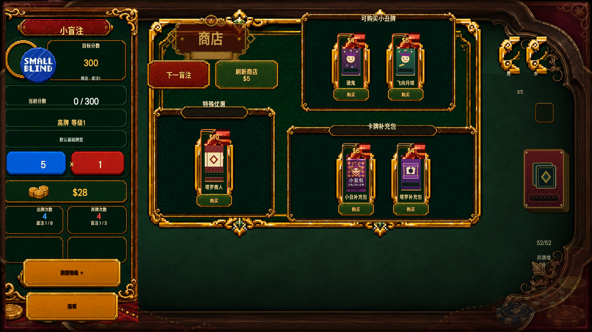
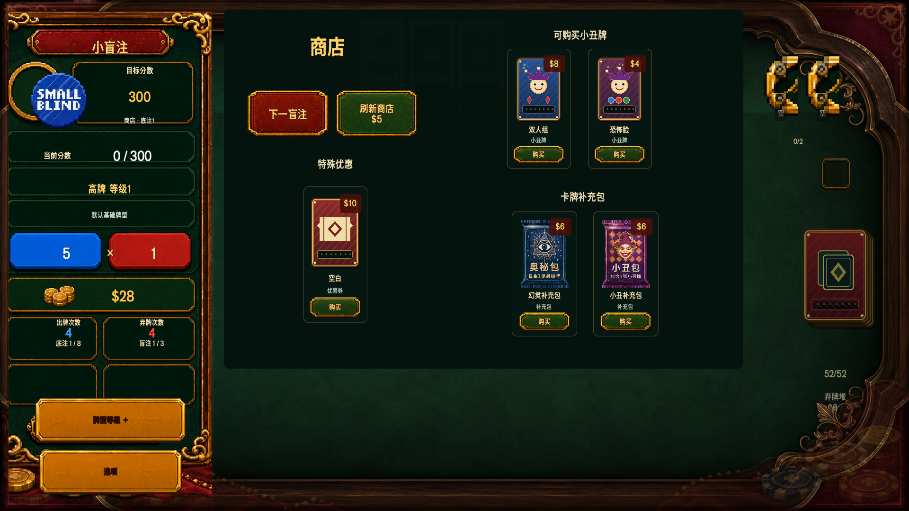

# Visual De-layering Phase 1

本阶段仅修改全局面板默认规则、商店页面、商店商品卡，以及对应的静态检查、状态测试和截图工具。玩法、价格、商品数量、场景路由、阶段切换、购买/补充包流程均未改动。

## 修改前后

| 修改前（1920×1080） | 修改后（1920×1080） |
| --- | --- |
|  |  |

## 验收截图

- [商店默认 1920×1080](after/shop_default_1920x1080.png)
- [商品 Hover 1920×1080](after/shop_product_hover_1920x1080.png)
- [金币不足 1920×1080](after/shop_insufficient_funds_1920x1080.png)
- [商品售出 1920×1080](after/shop_item_sold_1920x1080.png)
- [补充包打开 1920×1080](after/shop_pack_open_1920x1080.png)
- [商店默认 1280×720](after/shop_default_1280x720.png)

## 删除或弱化的视觉层级

- 普通 `PanelContainer` 和 `PopupPanel` 不再默认继承华丽面板。
- 商店总华丽框改为单一弱表面。
- 小丑牌、优惠券、补充包三个区域的完整装饰纹理框已移除，改用标题、间距和留白分组。
- 商品卡移除了 `CardBackground`、`ProductFrame`、Hover 描边节点和金币不足遮罩叠层。
- Hover 只保留上移 8 像素、1.025 缩放和轻微提亮，结束后恢复。

## 保留的功能

- 商店标题、下一盲注、刷新及费用递增。
- 小丑牌、优惠券、补充包分组和购买流程。
- 金币不足、槽位已满、商品售出、Disabled 状态。
- 补充包打开、选择和跳过流程。
- 商品图案、名称、类型、价格和购买按钮。

## 验证结果

- 全部生产场景加载检查通过。
- 按钮完整性、游戏桌阶段持久化、阶段面板流、smoke run 通过。
- 商店、补充包、优惠券、盲注、回合、结算流程测试通过。
- UI 静态结构和新增视觉复杂度检查通过。
- 1280×720、1600×900、1920×1080、2560×1440、1920×1200、2520×1080 分辨率测试通过。
- 专用商店状态测试覆盖默认、Hover 恢复、金币不足、槽位已满、售出、补充包、刷新、下一盲注和 Disabled。
- Godot AI MCP 运行态检查无脚本或游戏错误；截图仍需人工视觉验收。

## 修改文件

- `assets/ui/theme/game_theme.tres`
- `scenes/game/phases/shop_panel.tscn`
- `scenes/shop/shop_offer_card.tscn`
- `scripts/game/phases/shop_panel.gd`
- `scripts/shop/shop_offer_card.gd`
- `tests/test_visual_complexity.gd`
- `tests/test_shop_ui_states.gd`
- `tests/capture_visual_delayering_phase1.gd`
- `tests/capture_visual_delayering_phase1.tscn`
- `docs/visual_delayering_phase1/**`

## 已知风险

- 全局 `PanelContainer` 默认透明后，未来新增页面必须显式选择 `SurfacePanel`、`OrnatePanel`、`CardPanel` 或 `PopupSurface`；否则会按布局容器处理。
- 1280×720 已通过自动布局检查和截图检查，但中文长商品名仍依赖现有截断规则。
- 本阶段的自动测试不能替代人工视觉判断；Draft PR 保持待人工截图验收状态。
